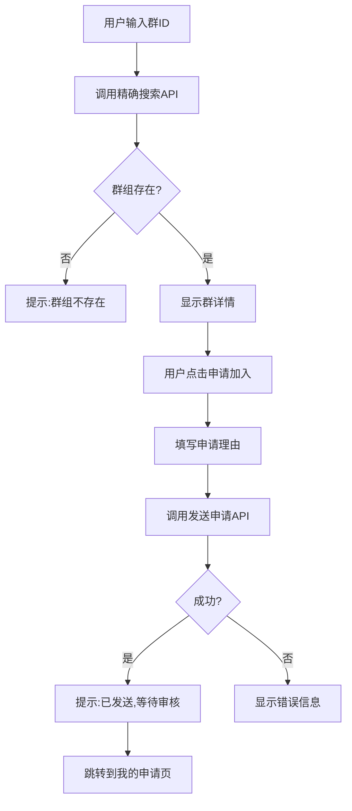
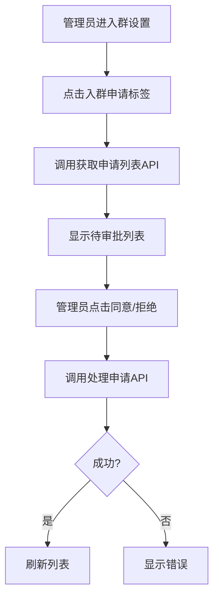
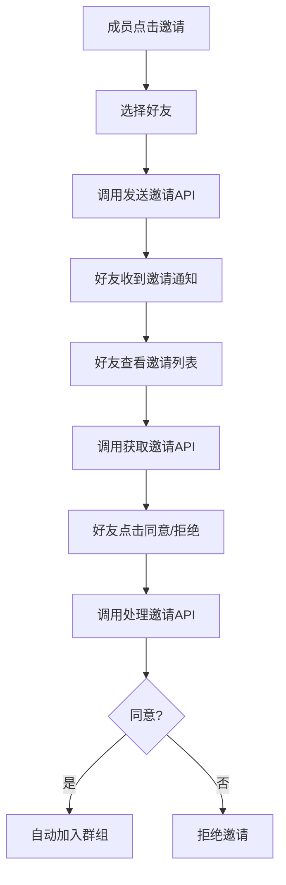
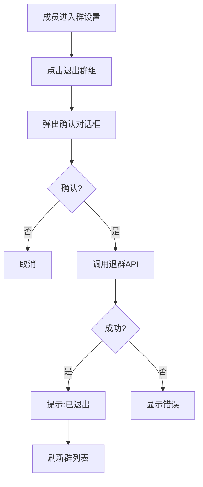
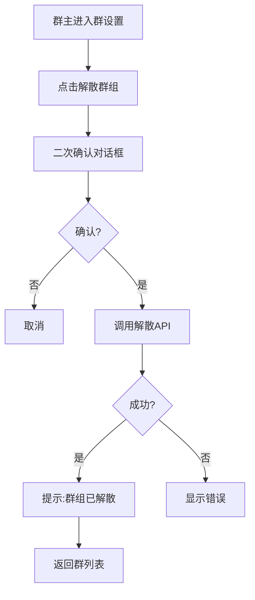

# 群聊功能完整API对接文档

> **SkyeIM 群聊模块前端对接指南**  
> 最后更新: 2026-01-16  
> 包含: 群组管理、成员管理、群邀请、入群申请 四大模块

---

## 📋 目录

1. [概述](#概述)
2. [群组管理模块](#一群组管理模块)
3. [成员管理模块](#二成员管理模块)  
4. [群邀请模块](#三群邀请模块)
5. [入群申请模块](#四入群申请模块)
6. [数据字段说明](#数据字段说明)
7. [错误码参考](#错误码参考)
8. [完整UI流程](#完整ui流程)

---

## 概述

### Base URL
```
http://localhost:8080
```

### 通用请求头
```
Authorization: Bearer <access_token>
Content-Type: application/json
```

### 接口总览

| 模块 | 接口数 | 说明 |
|------|-------|------|
| 群组管理 | 7个 | 创建、解散、更新、查询、搜索 |
| 成员管理 | 7个 | 邀请、踢出、退群、权限、禁言 |
| 群邀请 | 4个 | 成员邀请他人入群 |
| 入群申请 | 5个 | 用户主动申请入群 + 通知中心 |

**共计**: 23个API接口

---

## 一、群组管理模块

### 1.1 创建群组

**场景**: 用户创建新的群聊

**端点**: `POST /api/v1/group/create`

**请求体**:
```json
{
  "name": "技术交流群",              // 必填：群名称
  "avatar": "https://...",          // 选填：群头像URL
  "description": "分享技术心得",     // 选填：群描述
  "maxMembers": 200,                // 选填：最大成员数，默认200
  "memberIds": [10002, 10003]       // 选填：初始成员ID列表（不含创建者）
}
```

**成功响应** (200):
```json
{
  "code": 200,
  "message": "群组创建成功",
  "data": {
    "groupId": "g_20260112_001"   // 生成的群组ID
  }
}
```

**TypeScript示例**:
```typescript
async function createGroup(groupData: {
  name: string;
  avatar?: string;
  description?: string;
  maxMembers?: number;
  memberIds?: number[];
}) {
  const response = await fetch('/api/v1/group/create', {
    method: 'POST',
    headers: {
      'Authorization': `Bearer ${getToken()}`,
      'Content-Type': 'application/json'
    },
    body: JSON.stringify(groupData)
  });
  
  const result = await response.json();
  if (result.code === 200) {
    return result.data.groupId;
  }
  throw new Error(result.message);
}
```

**注意事项**:
- 创建者自动成为群主(role=1)
- memberIds最多500人
- 群ID由后端生成，格式：`g_yyyyMMdd_序号`

---

### 1.2 解散群组

**场景**: 群主解散群组

**端点**: `POST /api/v1/group/dismiss`

**请求体**:
```json
{
  "groupId": "g_20260112_001"
}
```

**成功响应** (200):
```json
{
  "code": 200,
  "message": "群组已解散"
}
```

**权限**: 仅群主可操作

**错误响应**:
```json
{
  "code": 500,
  "message": "只有群主可以解散群组"
}
```

---

### 1.3 更新群信息

**场景**: 群主/管理员修改群名称、头像等

**端点**: `POST /api/v1/group/update`

**请求体**:
```json
{
  "groupId": "g_20260112_001",
  "name": "新群名",              // 选填
  "avatar": "https://...",      // 选填
  "description": "新描述",      // 选填
  "maxMembers": 500            // 选填
}
```

**成功响应** (200):
```json
{
  "code": 200,
  "message": "群信息已更新"
}
```

**权限**: 群主或管理员

---

### 1.4 获取群组列表

**场景**: 获取当前用户加入的所有群组

**端点**: `GET /api/v1/group/list?page=1&pageSize=20`

**查询参数**:
| 参数 | 类型 | 默认值 | 说明 |
|------|------|--------|------|
| page | number | 1 | 页码 |
| pageSize | number | 20 | 每页数量 |

**成功响应** (200):
```json
{
  "code": 200,
  "message": "查询成功",
  "data": {
    "list": [
      {
        "groupId": "g_20260112_001",
        "name": "技术交流群",
        "avatar": "https://...",
        "ownerId": 10001,
        "description": "分享技术心得",
        "memberCount": 25,
        "maxMembers": 200,
        "status": 1,              // 1-正常 2-已解散
        "createdAt": 1736683200,  // Unix时间戳(秒)
        "updatedAt": 1736683200
      }
    ],
    "total": 5
  }
}
```

**TypeScript示例**:
```typescript
interface GroupInfo {
  groupId: string;
  name: string;
  avatar: string;
  ownerId: number;
  description: string;
  memberCount: number;
  maxMembers: number;
  status: number;
  createdAt: number;
  updatedAt: number;
}

async function getMyGroups(page = 1, pageSize = 20) {
  const response = await fetch(
    `/api/v1/group/list?page=${page}&pageSize=${pageSize}`,
    {
      headers: {
        'Authorization': `Bearer ${getToken()}`
      }
    }
  );
  
  const result = await response.json();
  if (result.code === 200) {
    return {
      list: result.data.list as GroupInfo[],
      total: result.data.total as number
    };
  }
  throw new Error(result.message);
}
```

---

### 1.5 获取群组详情

**场景**: 查看群组的详细信息

**端点**: `GET /api/v1/group/:groupId`

**路径参数**:
- `groupId`: 群组ID

**示例**:
```bash
GET /api/v1/group/g_20260112_001
```

**成功响应** (200):
```json
{
  "code": 200,
  "message": "查询成功",
  "data": {
    "groupId": "g_20260112_001",
    "name": "技术交流群",
    "avatar": "https://...",
    "ownerId": 10001,
    "description": "分享技术心得",
    "memberCount": 25,
    "maxMembers": 200,
    "status": 1,
    "createdAt": 1736683200,
    "updatedAt": 1736683200
  }
}
```

---

### 1.6 搜索群组（模糊）

**场景**: 通过关键词模糊搜索群组

**端点**: `GET /api/v1/group/search?keyword=技术`

**查询参数**:
- `keyword`: 搜索关键词（群名称）

**成功响应** (200):
```json
{
  "code": 200,
  "message": "查询成功",
  "data": {
    "list": [
      { /* GroupInfo */ }
    ],
    "total": 3
  }
}
```

---

### 1.7 精确搜索群组

**场景**: 通过群ID精确查找群组（用于申请入群前）

**端点**: `GET /api/v1/group/search/precise?groupId=g_20260112_001`

**查询参数**:
- `groupId`: 完整的群组ID

**成功响应** (200):
```json
{
  "code": 200,
  "message": "查询成功",
  "data": {
    "list": [
      { /* GroupInfo */ }
    ],
    "total": 1
  }
}
```

**前端典型用法**:
```typescript
// 用户输入群ID，搜索群组，然后申请加入
async function searchAndJoin(groupId: string) {
  const result = await searchGroupPrecise(groupId);
  
  if (result.list.length === 0) {
    showError('群组不存在');
    return;
  }
  
  const group = result.list[0];
  // 显示群信息，提供"申请加入"按钮
  showGroupDetail(group);
}
```

---

## 二、成员管理模块

### 2.1 邀请成员

**场景**: 群成员邀请好友加入群组

**端点**: `POST /api/v1/group/member/invite`

**请求体**:
```json
{
  "groupId": "g_20260112_001",
  "memberIds": [10005, 10006, 10007]  // 被邀请的用户ID列表
}
```

**成功响应** (200):
```json
{
  "code": 200,
  "message": "邀请已发送",
  "data": {
    "successCount": 2,        // 成功邀请人数
    "failedIds": [10007]      // 失败的用户ID（可能已是成员或不存在）
  }
}
```

**注意**: 这是**直接拉人入群**，非邀请流程。邀请流程见3.1

---

### 2.2 踢出成员

**场景**: 群主/管理员踢出成员

**端点**: `POST /api/v1/group/member/kick`

**请求体**:
```json
{
  "groupId": "g_20260112_001",
  "memberId": 10005
}
```

**成功响应** (200):
```json
{
  "code": 200,
  "message": "成员已移除"
}
```

**权限**: 群主或管理员

**限制**: 不能踢出群主

---

### 2.3 退出群组

**场景**: 普通成员主动退出群组

**端点**: `POST /api/v1/group/quit`

**请求体**:
```json
{
  "groupId": "g_20260112_001"
}
```

**成功响应** (200):
```json
{
  "code": 200,
  "message": "已退出群组"
}
```

**限制**: 群主不能退群，只能解散群

**TypeScript示例**:
```typescript
async function quitGroup(groupId: string) {
  if (!confirm('确定要退出该群组吗？')) {
    return;
  }
  
  const response = await fetch('/api/v1/group/quit', {
    method: 'POST',
    headers: {
      'Authorization': `Bearer ${getToken()}`,
      'Content-Type': 'application/json'
    },
    body: JSON.stringify({ groupId })
  });
  
  const result = await response.json();
  if (result.code === 200) {
    showSuccess('已退出群组');
    // 刷新群列表
    refreshGroupList();
  } else {
    showError(result.message);
  }
}
```

---

### 2.4 获取成员列表

**场景**: 查看群组所有成员

**端点**: `GET /api/v1/group/member/list?groupId=g_20260112_001&page=1&pageSize=20`

**查询参数**:
| 参数 | 类型 | 默认值 | 说明 |
|------|------|--------|------|
| groupId | string | - | 必填：群组ID |
| page | number | 1 | 页码 |
| pageSize | number | 20 | 每页数量 |

**成功响应** (200):
```json
{
  "code": 200,
  "message": "查询成功",
  "data": {
    "list": [
      {
        "userId": 10001,
        "nickname": "张三",    // 群昵称（未设置则为用户昵称）
        "avatar": "https://...",
        "role": 1,            // 1-群主 2-管理员 3-普通成员
        "mute": 0,            // 0-正常 1-禁言
        "joinTime": 1736683200,
        "joinedAt": "2026-01-12 20:00:00",
        "readSeq": 1250       // 已读Seq
      }
    ],
    "total": 25
  }
}
```

**成员角色说明**:
- `role=1`: 群主（只有1个）
- `role=2`: 管理员（可多个）
- `role=3`: 普通成员

---

### 2.5 设置成员角色

**场景**: 群主设置管理员

**端点**: `POST /api/v1/group/member/role`

**请求体**:
```json
{
  "groupId": "g_20260112_001",
  "memberId": 10005,
  "role": 2                 // 1-群主 2-管理员 3-普通成员
}
```

**成功响应** (200):
```json
{
  "code": 200,
  "message": "角色已更新"
}
```

**权限**: 仅群主

**限制**: 不能转让群主（role=1需要专门的转让接口）

---

### 2.6 设置成员禁言

**场景**: 管理员禁言某成员

**端点**: `POST /api/v1/group/member/mute`

**请求体**:
```json
{
  "groupId": "g_20260112_001",
  "memberId": 10005,
  "mute": 1                 // 0-取消禁言 1-禁言
}
```

**成功响应** (200):
```json
{
  "code": 200,
  "message": "禁言设置成功"
}
```

**权限**: 群主或管理员

---

### 2.7 更新群组已读序列号

**场景**: 用户上报群聊已读进度

**端点**: `POST /api/v1/group/read`

**请求体**:
```json
{
  "groupId": "g_20260112_001",
  "readSeq": 1250          // 已读到的消息Seq
}
```

**成功响应** (200):
```json
{
  "code": 200,
  "message": "已读进度已更新"
}
```

**说明**: 用于群聊消息未读计数，前端需定期上报

---

## 三、群邀请模块

> **场景**: 成员邀请好友，好友收到邀请后可同意/拒绝

### 3.1 发送入群邀请

**场景**: 群成员邀请好友加入群组

**端点**: `POST /api/v1/group/invitation/send`

**请求体**:
```json
{
  "groupId": "g_20260112_001",
  "inviteeId": 10008,           // 被邀请人ID
  "message": "来我们群聊聊天吧"   // 选填：邀请消息
}
```

**成功响应** (200):
```json
{
  "code": 200,
  "message": "邀请已发送",
  "data": {
    "invitationId": 456     // 邀请ID
  }
}
```

**与2.1的区别**:
- 2.1 `InviteMembers`: **直接拉人**入群（无需同意）
- 3.1 `SendGroupInvitation`: **发送邀请**（需对方同意）

---

### 3.2 处理入群邀请

**场景**: 被邀请人同意/拒绝邀请

**端点**: `POST /api/v1/group/invitation/handle`

**请求体**:
```json
{
  "invitationId": 456,
  "action": 1               // 1-同意 2-拒绝
}
```

**成功响应** (200):
```json
{
  "code": 200,
  "message": "已同意入群邀请"  // 或 "已拒绝入群邀请"
}
```

**错误响应**:
```json
// 邀请不存在
{
  "code": 500,
  "message": "邀请不存在"
}

// 邀请已处理
{
  "code": 500,
  "message": "邀请已处理"
}

// 群组已解散
{
  "code": 500,
  "message": "群组已解散，无法加入"
}

// 群成员已满
{
  "code": 500,
  "message": "群成员已满"
}
```

**TypeScript示例**:
```typescript
async function handleInvitation(invitationId: number, accept: boolean) {
  const action = accept ? 1 : 2;
  const response = await fetch('/api/v1/group/invitation/handle', {
    method: 'POST',
    headers: {
      'Authorization': `Bearer ${getToken()}`,
      'Content-Type': 'application/json'
    },
    body: JSON.stringify({ invitationId, action })
  });
  
  const result = await response.json();
  if (result.code === 200) {
    if (accept) {
      showSuccess('已加入群组');
      // 跳转到群聊
      navigateToGroup(groupId);
    } else {
      showSuccess('已拒绝邀请');
    }
  } else {
    showError(result.message);
  }
}
```

---

### 3.3 获取收到的邀请

**场景**: 查看收到的入群邀请

**端点**: `GET /api/v1/group/invitation/received?page=1&pageSize=20`

**成功响应** (200):
```json
{
  "code": 200,
  "message": "查询成功",
  "data": {
    "list": [
      {
        "id": 456,
        "groupId": "g_20260112_001",
        "groupName": "技术交流群",
        "inviterId": 10002,
        "inviterName": "李四",
        "inviteeId": 10008,
        "inviteeName": "王五",
        "message": "来我们群聊聊天吧",
        "status": 0,          // 0-待处理 1-已同意 2-已拒绝
        "createdAt": 1736683200
      }
    ],
    "total": 3
  }
}
```

---

### 3.4 获取发送的邀请

**场景**: 查看我发出的邀请记录

**端点**: `GET /api/v1/group/invitation/sent?page=1&pageSize=20`

**成功响应**: 同3.3，返回发出的邀请列表

---

## 四、入群申请模块

> **场景**: 用户主动搜索群组并申请加入，管理员审批

### 4.1 发送入群申请

**场景**: 用户搜索到群组后申请加入

**端点**: `POST /api/v1/group/join/request`

**请求体**:
```json
{
  "groupId": "g_20260112_001",
  "message": "我想加入学习"   // 选填：申请理由
}
```

**成功响应** (200):
```json
{
  "code": 200,
  "message": "申请已发送",
  "data": {
    "requestId": 789      // 申请ID
  }
}
```

**错误响应**:
```json
// 已是成员
{
  "code": 500,
  "message": "您已经是群成员"
}

// 已有pending申请
{
  "code": 500,
  "message": "已有待处理的入群申请，请耐心等待"
}

// 群组不存在
{
  "code": 500,
  "message": "群组不存在"
}

// 群组已解散
{
  "code": 500,
  "message": "群组已解散"
}
```

**重复申请处理逻辑** ⭐:
> 如果用户之前的申请已被处理（同意后被踢出、或被拒绝），再次申请时，**后端会自动复用历史申请记录**，将状态重置为"待处理"，前端无需特殊处理。
> 
> 这意味着：
> - 用户被踢出后可以立即再次申请，不会报错 ✅
> - 申请被拒绝后可以重新申请，不会因唯一键冲突失败 ✅
> - 只有当存在"待处理"的申请时，才会提示"请耐心等待" ⏳


**完整流程示例**:
```typescript
// 1. 用户输入群ID搜索
async function searchAndApplyJoin() {
  const groupId = prompt('请输入群组ID');
  
  // 2. 精确搜索群组
  const searchResult = await fetch(
    `/api/v1/group/search/precise?groupId=${groupId}`,
    {
      headers: { 'Authorization': `Bearer ${getToken()}` }
    }
  );
  const searchData = await searchResult.json();
  
  if (searchData.data.list.length === 0) {
    showError('群组不存在');
    return;
  }
  
  const group = searchData.data.list[0];
  
  // 3. 显示群信息，让用户填写申请理由
  const message = prompt(`申请加入【${group.name}】，请填写申请理由`);
  
  // 4. 发送申请
  const applyResult = await fetch('/api/v1/group/join/request', {
    method: 'POST',
    headers: {
      'Authorization': `Bearer ${getToken()}`,
      'Content-Type': 'application/json'
    },
    body: JSON.stringify({ groupId, message })
  });
  
  const applyData = await applyResult.json();
  
  if (applyData.code === 200) {
    showSuccess('申请已发送，请等待审核');
    // 跳转到"我的申请"页面
    navigateTo('/my-join-requests');
  } else {
    showError(applyData.message);
  }
}
```

---

### 4.2 处理入群申请

**场景**: 群主/管理员审批入群申请

**端点**: `POST /api/v1/group/join/handle`

**请求体**:
```json
{
  "requestId": 789,
  "action": 1               // 1-同意 2-拒绝
}
```

**成功响应** (200):
```json
{
  "code": 200,
  "message": "已同意入群申请"  // 或 "已拒绝入群申请"
}
```

**权限**: 群主或管理员

**错误响应**:
```json
// 权限不足
{
  "code": 500,
  "message": "只有群主或管理员可以处理申请"
}

// 申请已被处理
{
  "code": 500,
  "message": "该申请已被处理"
}

// 申请记录不存在
{
  "code": 500,
  "message": "申请记录不存在"
}

// 群组已解散
{
  "code": 500,
  "message": "群组已解散"
}

// 群成员已满（新增）⭐
{
  "code": 500,
  "message": "群成员已满，无法同意申请"
}
```

> [!IMPORTANT]
> **新增错误响应**：当管理员同意入群申请时，如果群成员已达到上限，将返回"群成员已满，无法同意申请"错误。前端应妥善处理此错误并提示管理员。

---

### 4.3 获取群组申请列表

**场景**: 管理员查看待审批的入群申请

**端点**: `GET /api/v1/group/join/requests?groupId=g_20260112_001&page=1&pageSize=20`

**查询参数**:
| 参数 | 类型 | 默认值 | 说明 |
|------|------|--------|------|
| groupId | string | - | 必填：群组ID |
| page | number | 1 | 页码 |
| pageSize | number | 20 | 每页数量 |

**成功响应** (200):
```json
{
  "code": 200,
  "message": "查询成功",
  "data": {
    "list": [
      {
        "id": 789,
        "groupId": "g_20260112_001",
        "groupName": "",       // 暂未实现，前端需自行获取
        "groupAvatar": "",     // 暂未实现
        "userId": 10009,
        "userName": "",        // 暂未实现，建议调用用户服务
        "userAvatar": "",      // 暂未实现
        "message": "我想加入学习",
        "status": 0,           // 0-待处理 1-已同意 2-已拒绝
        "handlerId": 0,        // 处理人ID，0表示未处理
        "createdAt": 1736683200
      }
    ],
    "total": 5
  }
}
```

**权限**: 群主或管理员

**前端补充用户信息示例**:
```typescript
async function getJoinRequests(groupId: string) {
  const response = await fetch(
    `/api/v1/group/join/requests?groupId=${groupId}`,
    {
      headers: { 'Authorization': `Bearer ${getToken()}` }
    }
  );
  
  const result = await response.json();
  
  if (result.code === 200) {
    const { list } = result.data;
    
    // 批量获取用户信息
    const userIds = list.map(req => req.userId);
    const users = await batchGetUserInfo(userIds);
    
    // 合并数据
    const enrichedList = list.map(req => ({
      ...req,
      userName: users[req.userId]?.username || '未知用户',
      userAvatar: users[req.userId]?.avatar || '/default-avatar.png'
    }));
    
    return enrichedList;
  }
}
```

---

### 4.4 获取所有管理群组的入群申请 ⭐ 新增

**场景**: 在通知中心一次性查看所有管理群组的待审批申请

**端点**: `GET /api/v1/group/join/received?page=1&pageSize=20`

**查询参数**:
| 参数 | 类型 | 默认值 | 说明 |
|------|------|--------|------|
| page | number | 1 | 页码 |
| pageSize | number | 20 | 每页数量 |

**与4.3的区别**:
- `4.3 /join/requests`: 查看**指定群组**的申请（需传groupId参数）- **在群聊详情页使用**
- `4.4 /join/received`: 查看**所有管理群组**的申请（无需groupId）- **在通知中心使用**

**成功响应** (200):
```json
{
  "code": 200,
  "message": "查询成功",
  "data": {
    "list": [
      {
        "id": 789,
        "groupId": "g_20260112_001",
        "groupName": "",       // 暂未实现，前端需自行获取
        "groupAvatar": "",     // 暂未实现
        "userId": 10009,
        "userName": "",        // 暂未实现，建议调用用户服务
        "userAvatar": "",      // 暂未实现
        "message": "我想加入学习",
        "status": 0,           // 0-待处理 1-已同意 2-已拒绝
        "handlerId": 0,        // 处理人ID，0表示未处理
        "createdAt": 1736683200
      },
      {
        "id": 790,
        "groupId": "g_20260112_002",  // 来自另一个群的申请
        "userId": 10010,
        "message": "请求加入",
        "status": 0,
        "handlerId": 0,
        "createdAt": 1736683300
      }
    ],
    "total": 15  // 来自所有管理群组的申请总数
  }
}
```

**权限**: 自动查询用户作为群主或管理员的群组（后端实现）

**空数据响应**:
```json
// 如果用户不是任何群的管理员
{
  "code": 200,
  "message": "查询成功",
  "data": {
    "list": [],
    "total": 0
  }
}
```

**TypeScript示例**:
```typescript
interface JoinRequestInfo {
  id: number;
  groupId: string;
  groupName?: string;
  groupAvatar?: string;
  userId: number;
  userName?: string;
  userAvatar?: string;
  message: string;
  status: number;
  handlerId: number;
  createdAt: number;
}

async function getAllJoinRequests(page = 1, pageSize = 20) {
  const response = await fetch(
    `/api/v1/group/join/received?page=${page}&pageSize=${pageSize}`,
    {
      headers: { 'Authorization': `Bearer ${getToken()}` }
    }
  );
  
  const result = await response.json();
  
  if (result.code === 200) {
    const { list } = result.data;
    
    // 批量获取群组信息和用户信息
    const groupIds = [...new Set(list.map(req => req.groupId))];
    const userIds = [...new Set(list.map(req => req.userId))];
    
    const [groups, users] = await Promise.all([
      batchGetGroupInfo(groupIds),
      batchGetUserInfo(userIds)
    ]);
    
    // 合并数据
    const enrichedList = list.map(req => ({
      ...req,
      groupName: groups[req.groupId]?.name || '未知群组',
      groupAvatar: groups[req.groupId]?.avatar || '/default-group.png',
      userName: users[req.userId]?.username || '未知用户',
      userAvatar: users[req.userId]?.avatar || '/default-avatar.png'
    }));
    
    return {
      list: enrichedList,
      total: result.data.total
    };
  }
  
  throw new Error(result.message);
}
```

**前端实现建议**:
```typescript
// 在通知中心页面使用
function NotificationCenter() {
  const [requests, setRequests] = useState([]);
  const [loading, setLoading] = useState(false);
  
  useEffect(() => {
    loadAllRequests();
  }, []);
  
  async function loadAllRequests() {
    setLoading(true);
    try {
      const data = await getAllJoinRequests();
      setRequests(data.list);
    } catch (error) {
      showError(error.message);
    } finally {
      setLoading(false);
    }
  }
  
  async function handleRequest(requestId: number, accept: boolean) {
    const action = accept ? 1 : 2;
    await handleJoinRequest(requestId, action);
    // 刷新列表
    loadAllRequests();
  }
  
  return (
    <div>
      {requests.map(req => (
        <div key={req.id} className="request-item">
          
          <div>
            <h4>{req.groupName}</h4>
            <p>{req.userName} 申请加入</p>
            <p>{req.message}</p>
          </div>
          <button onClick={() => handleRequest(req.id, true)}>同意</button>
          <button onClick={() => handleRequest(req.id, false)}>拒绝</button>
        </div>
      ))}
    </div>
  );
}
```

> [!IMPORTANT]
> **后端权限控制**
> 
> 此接口的权限控制**完全在后端实现**，前端无需判断用户权限：
> - 后端自动查询用户作为群主（role=1）或管理员（role=2）的所有群组
> - 只返回这些群组的待处理申请（status=0）
> - 如果用户不是任何群的管理员，返回空列表
> - 安全性由后端保证，前端无法绕过

---

### 4.5 获取我的入群申请

**场景**: 用户查看自己发出的申请记录

**端点**: `GET /api/v1/group/join/sent?page=1&pageSize=20`

**查询参数**:
| 参数 | 类型 | 默认值 | 说明 |
|------|------|--------|------|
| page | number | 1 | 页码 |
| pageSize | number | 20 | 每页数量 |

**成功响应** (200):
```json
{
  "code": 200,
  "message": "查询成功",
  "data": {
    "list": [
      {
        "id": 789,
        "groupId": "g_20260112_001",
        "groupName": "",       // 需前端补充
        "groupAvatar": "",
        "userId": 10009,       // 当前用户ID
        "userName": "",
        "userAvatar": "",
        "message": "我想加入学习",
        "status": 0,           // 0-待审核 1-已通过 2-已拒绝
        "handlerId": 10001,    // 处理人ID
        "createdAt": 1736683200
      }
    ],
    "total": 3
  }
}
```

**状态说明**:
- `status=0`: 待审核（橙色标签）
- `status=1`: 已通过（绿色标签，显示"进入群聊"按钮）
- `status=2`: 已拒绝（灰色标签）

---

## 数据字段说明

### GroupInfo (群组信息)

| 字段 | 类型 | 说明 |
|------|------|------|
| groupId | string | 群组ID，唯一标识 |
| name | string | 群名称 |
| avatar | string | 群头像URL |
| ownerId | number | 群主用户ID |
| description | string | 群描述 |
| memberCount | number | 当前成员数 |
| maxMembers | number | 最大成员数 |
| status | number | 1-正常 2-已解散 |
| createdAt | number | 创建时间（Unix秒） |
| updatedAt | number | 更新时间（Unix秒） |

---

### MemberInfo (成员信息)

| 字段 | 类型 | 说明 |
|------|------|------|
| userId | number | 用户ID |
| nickname | string | 群昵称 |
| avatar | string | 头像URL |
| role | number | 1-群主 2-管理员 3-普通成员 |
| mute | number | 0-正常 1-禁言 |
| joinTime | number | 加入时间戳（Unix秒） |
| joinedAt | string | 加入时间（格式化字符串） |
| readSeq | number | 已读Seq |

---

### GroupInvitationInfo (群邀请信息)

| 字段 | 类型 | 说明 |
|------|------|------|
| id | number | 邀请ID |
| groupId | string | 群组ID |
| groupName | string | 群名称 |
| inviterId | number | 邀请人ID |
| inviterName | string | 邀请人名称 |
| inviteeId | number | 被邀请人ID |
| inviteeName | string | 被邀请人名称 |
| message | string | 邀请消息 |
| status | number | 0-待处理 1-已同意 2-已拒绝 |
| createdAt | number | 创建时间（Unix秒） |

---

### JoinRequestInfo (入群申请信息)

| 字段 | 类型 | 说明 |
|------|------|------|
| id | number | 申请ID |
| groupId | string | 群组ID |
| groupName | string | 群名称（需前端补充） |
| groupAvatar | string | 群头像（需前端补充） |
| userId | number | 申请人ID |
| userName | string | 申请人名称（需前端补充） |
| userAvatar | string | 申请人头像（需前端补充） |
| message | string | 申请理由 |
| status | number | 0-待处理 1-已同意 2-已拒绝 |
| handlerId | number | 处理人ID |
| createdAt | number | 申请时间（Unix秒） |

---

## 错误码参考

### 通用错误

| code | message | 说明 |
|------|---------|------|
| 401 | 未授权 | JWT token无效或过期 |
| 500 | 各种业务错误 | 见具体message |

### 权限相关

| message | 说明 | 解决方案 |
|---------|------|---------|
| 只有群主可以解散群组 | 非群主尝试解散 | 检查role |
| 只有群主或管理员可以... | 权限不足 | 检查role |
| 您不是群成员 | 非成员操作 | 先加入群 |

### 状态相关

| message | 说明 | 解决方案 |
|---------|------|---------|
| 群组不存在 | groupId无效 | 检查ID |
| 群组已解散 | status=2 | 提示用户 |
| 您已经是群成员 | 重复入群 | 跳转到群聊 |
| 已有待处理的入群申请 | 重复申请 | 显示待审核状态 |
| 该申请已被处理 | status≠0 | 刷新列表 |

---

## 完整UI流程

### 流程1: 用户搜索并申请入群



**关键接口**:
1. `GET /api/v1/group/search/precise?groupId=xxx`
2. `POST /api/v1/group/join/request`
3. `GET /api/v1/group/join/sent`

---

### 流程2: 管理员审批入群申请



**关键接口**:
1. `GET /api/v1/group/join/requests?groupId=xxx`
2. `POST /api/v1/group/join/handle`

---

### 流程3: 成员邀请好友入群



**关键接口**:
1. `POST /api/v1/group/invitation/send`
2. `GET /api/v1/group/invitation/received`
3. `POST /api/v1/group/invitation/handle`

---

### 流程4: 普通成员退群



**关键接口**:
1. `POST /api/v1/group/quit`
2. `GET /api/v1/group/list`

---

### 流程5: 群主解散群组



**关键接口**:
1. `POST /api/v1/group/dismiss`
2. `GET /api/v1/group/list`

---

## 完整Vue3组件示例

### 入群申请管理组件

```vue
<template>
  <div class="join-requests-manager">
    <h2>入群申请管理</h2>
    
    <!-- 申请列表 -->
    <div v-if="loading" class="loading">加载中...</div>
    
    <div v-else-if="requests.length === 0" class="empty">
      暂无待处理申请
    </div>
    
    <div v-else class="request-list">
      <div 
        v-for="request in requests" 
        :key="request.id" 
        class="request-item"
      >
        
        <div class="info">
          <div class="name">{{ request.userName }}</div>
          <div class="message">{{ request.message }}</div>
          <div class="time">{{ formatTime(request.createdAt) }}</div>
        </div>
        <div class="actions">
          <button 
            @click="handleRequest(request.id, 1)" 
            class="btn-approve"
            :disabled="processing"
          >
            同意
          </button>
          <button 
            @click="handleRequest(request.id, 2)" 
            class="btn-reject"
            :disabled="processing"
          >
            拒绝
          </button>
        </div>
      </div>
    </div>
    
    <!-- 分页 -->
    <pagination 
      v-if="total > pageSize"
      :current="page" 
      :total="total" 
      :pageSize="pageSize"
      @change="loadRequests"
    />
  </div>
</template>

<script setup lang="ts">
import { ref, onMounted } from 'vue';

interface JoinRequest {
  id: number;
  userId: number;
  userName: string;
  userAvatar: string;
  message: string;
  createdAt: number;
}

const props = defineProps<{
  groupId: string;
}>();

const requests = ref<JoinRequest[]>([]);
const loading = ref(false);
const processing = ref(false);
const page = ref(1);
const pageSize = ref(20);
const total = ref(0);

async function loadRequests(p = 1) {
  loading.value = true;
  page.value = p;
  
  try {
    const response = await fetch(
      `/api/v1/group/join/requests?groupId=${props.groupId}&page=${p}&pageSize=${pageSize.value}`,
      {
        headers: {
          'Authorization': `Bearer ${getToken()}`
        }
      }
    );
    
    const result = await response.json();
    
    if (result.code === 200) {
      const { list, total: t } = result.data;
      
      // 批量获取用户信息
      const userIds = list.map(req => req.userId);
      const users = await batchGetUserInfo(userIds);
      
      // 合并数据
      requests.value = list.map(req => ({
        ...req,
        userName: users[req.userId]?.username || '未知用户',
        userAvatar: users[req.userId]?.avatar || '/default-avatar.png'
      }));
      
      total.value = t;
    }
  } catch (error) {
    console.error('加载失败', error);
  } finally {
    loading.value = false;
  }
}

async function handleRequest(requestId: number, action: 1 | 2) {
  const actionText = action === 1 ? '同意' : '拒绝';
  
  if (!confirm(`确定要${actionText}该申请吗？`)) {
    return;
  }
  
  processing.value = true;
  
  try {
    const response = await fetch('/api/v1/group/join/handle', {
      method: 'POST',
      headers: {
        'Authorization': `Bearer ${getToken()}`,
        'Content-Type': 'application/json'
      },
      body: JSON.stringify({ requestId, action })
    });
    
    const result = await response.json();
    
    if (result.code === 200) {
      showSuccess(result.message);
      await loadRequests(page.value);
    } else {
      showError(result.message);
    }
  } catch (error) {
    showError('操作失败');
  } finally {
    processing.value = false;
  }
}

function formatTime(timestamp: number): string {
  const date = new Date(timestamp * 1000);
  const now = new Date();
  const diff = now.getTime() - date.getTime();
  const diffMins = Math.floor(diff / 60000);
  
  if (diffMins < 60) return `${diffMins}分钟前`;
  if (diffMins < 1440) return `${Math.floor(diffMins / 60)}小时前`;
  
  return date.toLocaleDateString('zh-CN');
}

onMounted(() => {
  loadRequests();
});
</script>

<style scoped>
.request-item {
  display: flex;
  align-items: center;
  padding: 16px;
  border-bottom: 1px solid #eee;
}

.avatar {
  width: 48px;
  height: 48px;
  border-radius: 50%;
  margin-right: 12px;
}

.info {
  flex: 1;
}

.name {
  font-weight: 500;
  margin-bottom: 4px;
}

.message {
  color: #666;
  font-size: 14px;
  margin-bottom: 4px;
}

.time {
  color: #999;
  font-size: 12px;
}

.actions {
  display: flex;
  gap: 8px;
}

.btn-approve {
  background: #07c160;
  color: white;
  border: none;
  padding: 8px 16px;
  border-radius: 4px;
  cursor: pointer;
}

.btn-reject {
  background: #ee0a24;
  color: white;
  border: none;
  padding: 8px 16px;
  border-radius: 4px;
  cursor: pointer;
}

button:disabled {
  opacity: 0.5;
  cursor: not-allowed;
}
</style>
```

---

## 注意事项

### 1. 用户/群组信息补充

**问题**: API返回的`userName`、`groupName`等字段为空。

**解决方案**:
```typescript
// 方案1: 批量查询用户服务
async function batchGetUserInfo(userIds: number[]) {
  const response = await fetch(
    `/api/v1/user/batch?ids=${userIds.join(',')}`,
    { headers: { 'Authorization': `Bearer ${getToken()}` } }
  );
  const result = await response.json();
  return result.data;
}

// 方案2: 从本地缓存查找
function getUserFromCache(userId: number) {
  return localStorage.getItem(`user_${userId}`);
}
```

### 2. 群邀请 vs 入群申请

**区别**:
- **群邀请**: 成员主动邀请 → 被邀请人被动接受
- **入群申请**: 用户主动申请 → 管理员被动审批

**UI建议**:
- 群邀请：显示在"我的邀请"页
- 入群申请：显示在"我的申请"页

### 3. 直接拉人 vs 发送邀请

**区别**:
- `POST /member/invite`: 直接拉人（无需同意）
- `POST /invitation/send`: 发送邀请（需同意）

**使用建议**: 
- 默认使用"发送邀请"更友好
- 特殊情况（如管理员批量导入）使用"直接拉人"

### 4. 权限判断

在前端判断用户权限，控制UI显示：

```typescript
function canManageGroup(myUserId: number, group: GroupInfo) {
  return myUserId === group.ownerId;
}

function canApproveJoinRequest(myRole: number) {
  return myRole === 1 || myRole === 2; // 群主或管理员
}
```

### 5. 防抖处理

对于申请/审批等操作，添加防抖避免重复提交：

```typescript
let isSubmitting = false;

async function submit() {
  if (isSubmitting) return;
  isSubmitting = true;
  
  try {
    await apiCall();
  } finally {
    isSubmitting = false;
  }
}
```

---

## 联系与支持

如有API问题或需求变更，请联系后端开发团队。

**文档版本**: v1.0  
**最后更新**: 2026-01-12 22:00
