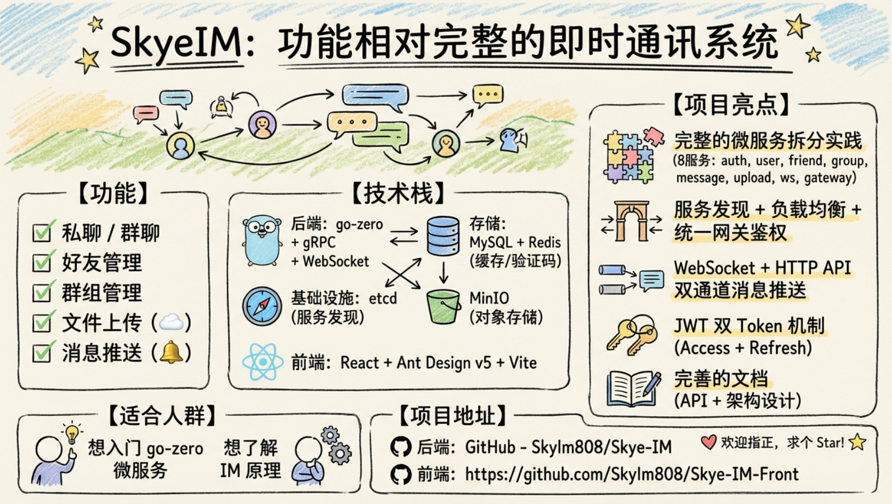

# SkyeIM - 现代化即时通讯系统

<div align="center">


一个基于 go-zero 框架构建的现代化即时通讯系统，采用微服务架构设计，支持私聊、群聊、好友管理等核心功能。

[功能特性](#-功能特性) • [技术栈](#-技术栈) • [快速开始](#-快速开始) • [架构设计](#-架构设计) • [API 文档](#-api-文档) • [开发指南](#-开发指南)

</div>

> [!NOTE]
> **前端项目**：[Skye-IM-Front](https://github.com/Skylm808/Skye-IM-Front) - 基于 React + Ant Design 的现代化 IM 客户端

---
**卡通信息图介绍**



## ✨ 功能特性

### 🔐 用户认证
- ✅ 邮箱验证码注册/登录
- ✅ JWT 双 Token 机制 (AccessToken + RefreshToken)
- ✅ 密码 bcrypt 加密存储
- ✅ 多方式登录（用户名/邮箱/手机号）
- ✅ Token 自动刷新机制

### 👥 好友管理
- ✅ 好友申请与处理
- ✅ 好友列表查询（分页）
- ✅ 好友删除
- ✅ 好友备注
- ✅ 黑名单管理

### 💬 即时消息
- ✅ WebSocket 实时通信
- ✅ 私聊消息收发
- ✅ 群聊消息收发
- ✅ @提及功能
- ✅ 消息已读/未读状态
- ✅ 离线消息推送（WebSocket 连接时自动推送）
- ✅ 历史消息分页拉取（HTTP API）
- ✅ 模糊搜索聊天记录

### 👬 群组功能
- ✅ 创建/解散群组
- ✅ 群成员管理（邀请/踢出）
- ✅ 入群申请/审批
- ✅ 退出群聊
- ✅ 群信息修改
- ✅ 群组搜索

### 📁 文件管理
- ✅ 头像上传
- ✅ 文件上传下载
- ✅ MinIO 对象存储集成

### 🔍 搜索功能
- ✅ 精确搜索用户（用户名/邮箱/手机）
- ✅ 模糊搜索群组
- ✅ 消息内容搜索

### 👤 用户信息
- ✅ 个人资料管理
- ✅ 在线状态管理
- ✅ 个性签名/性别/地区设置

---

## 🛠 技术栈

### 后端框架
| 技术 | 版本 | 说明 |
|------|------|------|
| **语言** | Go 1.25.4 | 高性能编程语言 |
| **框架** | [go-zero](https://github.com/zeromicro/go-zero) 1.6.0 | 微服务框架 |
| **通信** | gRPC / HTTP / WebSocket | 多协议支持 |

### 存储层
| 技术 | 说明 |
|------|------|
| **数据库** | MySQL | 关系型数据存储 |
| **缓存** | Redis | 高速缓存、验证码存储 |
| **服务发现** | etcd | 分布式配置与服务注册 |
| **对象存储** | MinIO | 文件存储服务 |

### 核心依赖
```go
github.com/zeromicro/go-zero     // 微服务框架
github.com/golang-jwt/jwt/v4     // JWT 认证
golang.org/x/crypto              // 密码加密 (bcrypt)
gopkg.in/gomail.v2               // 邮件发送
github.com/minio/minio-go/v7     // MinIO SDK
```

---

## 🚀 快速开始

### 前置要求

#### 方式一：本地开发环境
- Go 1.25.4+
- MySQL 8.0+
- Redis 6.0+ (默认端口 16379)
- etcd 3.5+
- MinIO (可选，用于文件存储，默认端口 9000)

#### 方式二：Docker 环境
- Docker 20.10+
- Docker Compose 2.0+
- 至少 4GB 可用内存
- 至少 10GB 可用磁盘空间

---

## 🐳 Docker 部署（推荐）

### 快速启动

Docker 部署会自动启动所有必需的服务，包括基础设施（MySQL、Redis、etcd、MinIO）和应用服务（所有 API、RPC、WebSocket、Gateway），无需手动配置。

```bash
# 克隆项目
git clone https://github.com/Skylm808/SkyeIM.git
cd SkyeIM

# 🚀 启动所有服务（首次启动会自动构建镜像）
docker-compose up -d --build

# 查看服务状态
docker-compose ps

# 查看所有服务日志
docker-compose logs -f

# 查看特定服务日志
docker-compose logs -f gateway
docker-compose logs -f user-rpc
docker-compose logs -f ws-server
```

### 访问服务

- **API 网关**: http://localhost:8080
- **WebSocket**: ws://localhost:10300
- **MinIO 控制台**: http://localhost:9001
  - 用户名: `minioadmin`
  - 密码: `minioadmin`

### 常用命令

```bash
# 停止所有服务
docker-compose down

# 停止并删除数据卷（谨慎使用，会清空数据库）
docker-compose down -v

# 重启所有服务
docker-compose restart

# 重启特定服务
docker-compose restart gateway user-api

# 查看服务资源占用
docker stats
```

### 性能优化构建（推荐）

如果你的机器配置较低或遇到构建时Docker崩溃的问题，建议使用**顺序构建脚本**:

```powershell
# Windows PowerShell
.\docker-build-sequential.ps1

# 脚本会分4个阶段逐步构建所有服务:
# 阶段1: 基础设施服务 (etcd, redis, mysql, minio)
# 阶段2: RPC 服务 (4个)
# 阶段3: API 服务 (6个)
# 阶段4: 应用层服务 (ws-server, gateway)
```

**优势**:
- ✅ **避免内存耗尽**: 逐个构建服务,释放资源
- ✅ **防止Docker崩溃**: 不会因并发构建过多服务导致系统卡死
- ✅ **实时进度显示**: 清晰展示构建进度和耗时
- ✅ **错误追踪**: 自动记录失败的服务

**构建优化**:
- 使用 BuildKit 缓存,第二次构建速度提升 **98%**
- 首次构建: 8-10分钟
- 代码改动后重新构建单个服务: ~30秒

完成后使用 `docker-compose up -d` 启动所有服务。


### Docker 部署优势

✅ **开箱即用**：无需手动安装配置 MySQL、Redis、etcd、MinIO  
✅ **环境隔离**：所有服务运行在独立容器中，互不干扰  
✅ **一键启停**：支持快速启动、停止、重启所有服务  
✅ **完整微服务**：所有 API 和 RPC 服务全部容器化  
✅ **服务健康检查**：自动检测服务状态，依赖服务就绪后再启动  
✅ **生产就绪**：可直接用于生产环境部署

> [!NOTE]
> **详细的 Docker 部署文档**：查看 [DOCKER_DEPLOYMENT.md](./DOCKER_DEPLOYMENT.md) 了解更多配置选项和故障排查。

> [!TIP]
> **首次使用建议**：
> 1. 启动后等待 1-2 分钟，让所有服务完成初始化
> 2. 访问前端应用时，清除浏览器缓存（localStorage）以避免旧数据冲突
> 3. 使用 `docker-compose ps` 确认所有服务状态为 `Up`

---

## 💻 本地开发部署

### 环境准备

#### 1️⃣ 安装依赖

```bash
# 克隆项目
git clone https://github.com/Skylm808/SkyeIM.git
cd SkyeIM

# 下载依赖
go mod download
```

#### 2️⃣ 启动基础服务

```bash
# 启动 MySQL (端口 3306)
# 启动 Redis (端口 16379)
redis-server --port 16379

# 启动 etcd (端口 2379)
etcd

# 启动 MinIO (端口 9000，可选)
minio server /data --console-address ":9001"
```

#### 3️⃣ 初始化数据库

**方式一：使用统一初始化脚本（推荐）**

项目根目录下提供了 `init_database.sql` 文件，包含所有数据表的创建语句。

```bash
# 登录 MySQL
mysql -u root -p

# 执行初始化脚本
source /path/to/SkyeIM/init_database.sql

# 或使用命令行直接导入
mysql -u root -p < init_database.sql
```

执行完成后，会自动创建 `im_auth` 数据库及以下 8 张表：
- ✅ `user` - 用户信息
- ✅ `im_friend` - 好友关系  
- ✅ `im_friend_request` - 好友申请
- ✅ `im_message` - 消息记录
- ✅ `im_group` - 群组信息
- ✅ `im_group_member` - 群成员
- ✅ `im_group_invitation` - 群邀请
- ✅ `im_group_join_request` - 入群申请

**方式二：手动执行各模块 SQL**

如果需要分模块执行，可参考以下文件：
- 用户模块: `app/auth/model/user.sql`
- 好友模块: `app/friend/im_friend.sql`, `app/friend/im_friend_request.sql`
- 群组模块: `app/group/im_group*.sql` (4个文件)
- 消息模块: `app/message/im_message.sql`

#### 4️⃣ 配置 QQ 邮箱 SMTP（发送验证码必需）

系统使用 QQ 邮箱发送注册验证码，需要先开启 SMTP 服务并获取授权码。

> [!TIP]
> **详细图文教程**: [使用QQ邮箱发送邮件，QQ邮箱的smtp设置](https://cloud.tencent.com/developer/article/2177098)

**步骤一：开启 QQ 邮箱 SMTP 服务**

1. 登录 [QQ邮箱](https://mail.qq.com)
2. 点击 **设置** → **账户**
3. 找到 **POP3/SMTP服务** 或 **IMAP/SMTP服务**
4. 点击 **开启**
5. 按照提示发送短信验证
6. 开启成功后，点击 **生成授权码**
7. **复制并保存授权码**（这不是你的 QQ 密码！）

**步骤二：配置服务**

编辑 `app/auth/etc/auth-api.yaml`:

```yaml
Email:
  Host: smtp.qq.com        # SMTP 服务器
  Port: 465                # 端口号（必须是 465）
  Username: your@qq.com    # 你的完整 QQ 邮箱地址
  Password: your-auth-code # 刚才生成的授权码（不是QQ密码！）
  From: "SkyeIM系统"       # 发件人显示名称
```

> [!IMPORTANT]
> **常见错误**：
> - ❌ 端口号错误：必须使用 `465`，不是 `25` 或 `587`
> - ❌ 密码错误：必须使用**授权码**，不是 QQ 邮箱登录密码
> - ❌ 用户名不完整：必须包含 `@qq.com`，如 `123456@qq.com`

**测试邮件发送**

启动 Auth 服务后，调用发送验证码接口测试：

```bash
curl -X POST http://localhost:8080/api/v1/auth/captcha/send \
  -H "Content-Type: application/json" \
  -d '{"email": "test@example.com"}'
```

#### 5️⃣ 配置服务

修改各服务的配置文件 `etc/*.yaml`，配置数据库、Redis、etcd 连接信息。

**关键配置项**：
- 🔑 **JWT Secret**: `Skylm-im-secret-key` (所有服务必须一致)
- 🗄️ **MySQL**: `root:630630@tcp(127.0.0.1:3306)/im_auth`
- 📦 **Redis**: `127.0.0.1:16379` (无密码)
- 📡 **etcd**: `127.0.0.1:2379`
- 📧 **SMTP**: 见上方 QQ 邮箱配置

### 启动服务

#### 方式一：独立启动各服务

```bash
# 1. 启动 Auth API (端口 10001)
cd app/auth && go run auth.go

# 2. 启动 User API (端口 10100)
cd app/user/api && go run user.go

# 3. 启动 Friend API (端口 10200)
cd app/friend/api && go run friend.go

# 4. 启动 Message API (端口 10400)
cd app/message/api && go run message.go

# 5. 启动 Group API (端口 10500)
cd app/group/api && go run group.go

# 6. 启动 Upload API (端口 10600)
cd app/upload/api && go run upload.go

# 7. 启动 WebSocket 服务 (端口 10300)
cd app/ws && go run ws.go

# 8. 启动 API 网关 (端口 8080)
cd app/gateway && go run gateway.go
```

#### 方式二：启动 RPC 服务（可选）

```bash
# User RPC (端口 9100)
cd app/user/rpc && go run user.go

# Friend RPC (端口 9200)
cd app/friend/rpc && go run friend.go

# Message RPC (端口 9300)
cd app/message/rpc && go run message.go

# Group RPC (端口 9400)
cd app/group/rpc && go run group.go
```

#### 方式三：使用 VSCode 任务启动（推荐）

项目已配置好 VSCode 任务，可以一键启动所有服务。

**单个服务启动**：
1. 按 `Ctrl+Shift+P` (Mac: `Cmd+Shift+P`)
2. 输入 `Tasks: Run Task`
3. 选择要启动的服务：
   - `Run Auth API` - 认证服务
   - `Run User API` / `Run User RPC` - 用户服务
   - `Run Friend API` / `Run Friend RPC` - 好友服务
   - `Run Message API` / `Run Message RPC` - 消息服务
   - `Run Group API` / `Run Group RPC` - 群组服务
   - `Run Upload API` - 上传服务
   - `Run Gateway` - 网关
   - `Run WebSocket` - WebSocket 服务

**一键启动所有服务**：
1. 按 `Ctrl+Shift+P` (Mac: `Cmd+Shift+P`)
2. 输入 `Tasks: Run Task`
3. 选择 `🚀 Start All Services`

这会自动启动所有 RPC、API、Gateway 和 WebSocket 服务，每个服务在独立的终端窗口运行。

**其他组合任务**：
- `Start All RPC Services` - 启动所有 RPC 服务
- `Start All API Services` - 启动所有 API 服务

> [!TIP]
> VSCode 任务配置文件位于 `.vscode/tasks.json`，可根据需要自定义。

### 验证服务

```bash
# 测试注册接口
curl -X POST http://localhost:8080/api/v1/auth/register \
  -H "Content-Type: application/json" \
  -d '{
    "username": "testuser",
    "password": "123456",
    "email": "test@example.com",
    "captcha": "123456"
  }'

# 测试登录接口
curl -X POST http://localhost:8080/api/v1/auth/login \
  -H "Content-Type: application/json" \
  -d '{
    "username": "testuser",
    "password": "123456"
  }'
```

---

## 📝 配置示例

以下是核心服务的配置文件示例，帮助你快速配置项目。

<details>
<summary><b>点击查看 Auth API 配置</b> (app/auth/etc/auth-api.yaml)</summary>

```yaml
Name: auth-api
Port: 10001
MySQL:
  DataSource: root:630630@tcp(127.0.0.1:3306)/im_auth?charset=utf8mb4&parseTime=True
Cache:
  - Host: 127.0.0.1:16379
    Type: node
    Pass: ""
Auth:
  AccessSecret: "Skylm-im-secret-key"
  AccessExpire: 604800
Etcd:
  Hosts:
    - 127.0.0.1:2379
  Key: auth-api
```

</details>

<details>
<summary><b>点击查看 Gateway 配置</b> (app/gateway/etc/gateway.yaml)</summary>

```yaml
Name: gateway
Port: 8080
Etcd:
  Hosts:
    - 127.0.0.1:2379
Auth:
  AccessSecret: "Skylm-im-secret-key"
WhiteList:
  - ^/api/v1/auth/login$
  - ^/api/v1/auth/register$
  - ^/api/v1/auth/captcha/send$
```

</details>

<details>
<summary><b>点击查看 WebSocket 配置</b> (app/ws/etc/ws.yaml)</summary>

```yaml
Name: ws-server
Port: 10300
Auth:
  AccessSecret: "Skylm-im-secret-key"
Redis:
  Host: 127.0.0.1:16379
  Pass: ""
WebSocket:
  PingInterval: 54
  PongTimeout: 60
  MaxMessageSize: 65536
```

</details>

> [!IMPORTANT]
> **配置要点**：
> - 🔑 **JWT Secret**: `Skylm-im-secret-key` (所有服务必须一致)
> - 🗄️ **Redis 端口**: `16379`
> - 🔐 **MySQL**: `root:630630@tcp(127.0.0.1:3306)/im_auth`
> - 📡 **etcd**: `127.0.0.1:2379`
> - 📧 **SMTP**: 需配置 QQ 邮箱授权码（见上方环境准备第4步）
> - 🗂️ **数据库**: 使用 `init_database.sql` 快速初始化

---

## 🏗 架构设计

### 整体架构

```
┌─────────────┐
│   前端应用   │
└──────┬──────┘
       │ HTTP/WebSocket
       ▼
┌───────────────────────────────────────┐
│          API Gateway (8080)           │
│  ┌──────────┬──────────────────────┐  │
│  │ JWT 鉴权 │   服务发现 (etcd)    │  │
│  │          │   负载均衡 (gRPC)    │  │
│  └──────────┴──────────────────────┘  │
└──────────────────┬────────────────────┘
                   │ HTTP (部分直接调用)
                   │ gRPC (大多数内部调用)
      ┌────────────┼─────────────┬─────────────┐
      ▼            ▼             ▼             ▼
┌───────────┐ ┌──────────┐ ┌───────────┐ ┌───────────┐
│Auth Service││ User Service││Message Service│ │ Group Service │
│ API:10001 │ │ API:10100│ │ API:10400 │ │ API:10500 │
│           │ │ RPC:9100 │ │ RPC:9300  │ │ RPC:9400  │
└─────┬─────┘ └────┬─────┘ └─────┬─────┘ └─────┬─────┘
      │            │             │             │
      └────────────┴─────────────┴─────────────┘
                   │
           ┌───────┴────────┐
           ▼                ▼
     ┌──────────┐     ┌──────────┐
     │  MySQL   │     │  Redis   │
     └──────────┘     └──────────┘

     ┌──────────────────────────┐
     │   WebSocket Server       │
     │        :10300            │
     └──────────────────────────┘
```

### 服务清单

| 服务 | 类型 | 端口 | 说明 |
|------|------|------|------|
| **gateway** | HTTP | 8080 | API 网关，统一入口 |
| **auth** | API | 10001 | 用户认证服务 |
| **user** | API/RPC | 10100/9100 | 用户信息服务 |
| **friend** | API/RPC | 10200/9200 | 好友管理服务 |
| **message** | API/RPC | 10400/9300 | 消息服务 |
| **group** | API/RPC | 10500/9400 | 群组服务 |
| **upload** | API | 10600 | 文件上传服务 |
| **ws** | WebSocket | 10300 | WebSocket 实时通信 |

### 技术特点

#### 🎯 微服务架构
- **服务隔离**：每个功能模块独立部署，互不影响
- **弹性扩展**：可根据负载独立扩展各服务
- **技术异构**：不同服务可选择最适合的技术栈

#### 🔄 服务通信
- **API 层**：HTTP RESTful API，面向前端
- **RPC 层**：gRPC 高性能内部调用
- **WebSocket**：实时双向通信

#### 🛡 网关层
- **统一入口**：所有请求经过 Gateway (8080)
- **JWT 鉴权**：双重 Token 验证机制
- **服务发现**：基于 etcd 自动路由
- **CORS 支持**：跨域配置

#### 📡 消息推送机制
- **WebSocket 连接**：
  - 连接成功后自动推送离线消息（私聊 + 群聊）
  - 实时接收新消息
- **HTTP API**：
  - 私聊历史：`GET /api/v1/message/history`
  - 群聊历史：`GET /api/v1/message/group/history`
  - 私聊离线同步：`GET /api/v1/message/offline`
  - 群聊离线同步：`GET /api/v1/message/group/sync`

#### 💾 数据层
#### 💾 数据层
- **MySQL**：持久化存储，支持事务
- **Redis 缓存**：
  - Model 级缓存（go-zero 自动）
  - 验证码存储（5 分钟 TTL）
  - 会话管理

### 🗄️ 数据库 Schema

| 模块 | 表定义 (SQL) |用于功能 |
|------|-------------|---------|
| **认证/用户** | [user.sql](app/auth/model/user.sql) | 用户基础信息、密码等 |
| **好友关系** | [im_friend.sql](app/friend/im_friend.sql) | 好友列表、备注等 |
| **好友申请** | [im_friend_request.sql](app/friend/im_friend_request.sql) | 待处理的好友请求 |
| **消息/聊天** | [im_message.sql](app/message/im_message.sql) | 私聊/群聊消息记录 |
| **群组信息** | [im_group.sql](app/group/im_group.sql) | 群基础信息(名、头像) |
| **群成员** | [im_group_member.sql](app/group/im_group_member.sql) | 群员列表、角色、禁言 |
| **群邀请** | [im_group_invitation.sql](app/group/im_group_invitation.sql) | 邀请入群记录 |
| **入群申请** | [im_group_join_request.sql](app/group/im_group_join_request.sql) | 主动加群申请记录 |

---

## 📖 API 文档

详细的 API 接口文档请查阅 `API/` 目录下的具体文档：

| 模块 | 文档链接 | 说明 |
|------|---------|------|
| **认证服务** | [AUTH_API文档.md](API/AUTH_API文档.md) | 注册、登录、验证码、Token刷新 |
| **用户服务** | [USER_API文档.md](API/USER_API文档.md) | 用户信息、搜索用户 |
| **好友服务** | [FRIEND_API文档.md](API/FRIEND_API文档.md) | 好友申请、黑名单、好友列表 |
| **群组服务** | [GROUP_API文档.md](API/GROUP_API文档.md) | 群组管理、成员管理、入群申请 |
| **消息服务** | [MESSAGE_API文档.md](API/MESSAGE_API文档.md) | 私聊/群聊消息、历史记录 |
| **文件上传** | [UPLOAD_API.md](API/UPLOAD_API.md) | 头像上传、文件管理 |
| **WebSocket** | [WEBSOCKET_API文档.md](API/WEBSOCKET_API文档.md) | 实时消息推送协议 |
| **API网关** | [GATEWAY_API文档.md](API/GATEWAY_API文档.md) | 网关路由规则与统一鉴权 |

## 🏗️ 架构文档

为了帮助开发者更好地理解系统内部的模块设计，我们提供了详细的架构设计文档：

| 模块 | 文档链接 | 说明 |
|------|---------|------|
| **认证服务** | [AUTH_ARCHITECTURE.md](docs/AUTH_ARCHITECTURE.md) | 认证流程、Token管理设计 |
| **网关服务** | [GATEWAY-ARCHITECTURE.md](docs/GATEWAY-ARCHITECTURE.md) | 网关路由、鉴权、限流设计 |
| **用户服务** | [USER-ARCHITECTURE.md](docs/USER-ARCHITECTURE.md) | 用户模型、信息管理设计 |
| **好友服务** | [friend_ARCHITECTURE.md](docs/friend_ARCHITECTURE.md) | 好友关系链、申请流程设计 |
| **群组服务** | [GROUP-ARCHITECTURE.md](docs/GROUP-ARCHITECTURE.md) | 群组管理、成员变更设计 |
| **消息服务** | [MESSAGE-ARCHITECTURE.md](docs/MESSAGE-ARCHITECTURE.md) | 消息投递、存储、离线同步设计 |
| **WebSocket** | [WS_ARCHITECTURE.md](docs/WS_ARCHITECTURE.md) | 长连接维护、消息推送机制 |

## 👨‍💻 开发指南

### 项目结构

```
SkyeIM/
├── app/                    # 应用服务
│   ├── auth/              # 认证服务
│   ├── user/              # 用户服务
│   │   ├── api/          # HTTP API
│   │   ├── rpc/          # gRPC 服务
│   │   └── model/        # 数据模型
│   ├── friend/            # 好友服务
│   ├── message/           # 消息服务
│   ├── group/             # 群组服务
│   ├── upload/            # 上传服务
│   ├── ws/                # WebSocket 服务
│   └── gateway/           # API 网关
├── common/                # 公共组件
│   ├── captcha/          # 验证码
│   ├── email/            # 邮件发送
│   ├── jwt/              # JWT 工具
│   ├── errorx/           # 错误处理
│   └── response/         # 响应封装
├── docs/                  # 文档
├── go.mod                # Go 模块
└── README.md             # 项目说明
```

### 添加新服务

#### 1. 定义 API

创建 `.api` 文件定义接口：

```go
// example.api
syntax = "v1"

type ExampleReq {
    Name string `json:"name"`
}

type ExampleResp {
    Id   int64  `json:"id"`
    Name string `json:"name"`
}

@server(
    prefix: /api/v1/example
    jwt: Auth
)
service example-api {
    @handler Example
    post /create (ExampleReq) returns (ExampleResp)
}
```

#### 2. 生成代码

```bash
# 生成 API 代码
goctl api go -api example.api -dir .

# 生成 RPC 代码 (如果需要)
goctl rpc protoc example.proto --go_out=. --go-grpc_out=. --zrpc_out=.
```

#### 3. 实现业务逻辑

在 `internal/logic/` 目录实现业务逻辑。

#### 4. 配置服务发现

在 `etc/` 配置文件中添加 etcd 配置：

```yaml
Name: example-api
Port: 10700

Etcd:
  Hosts:
    - 127.0.0.1:2379
  Key: example-api
```

### 代码规范

- **命名**：遵循 Go 官方命名规范
- **分层**：严格遵循 Handler → Logic → Model
- **错误处理**：使用 `common/errorx` 统一错误码
- **日志**：使用 `logx` 记录关键操作
- **缓存**：合理使用 Redis 缓存

### 测试

```bash
# 单元测试
go test ./...

# 性能测试
go test -bench=. -benchmem
```

---

## 📋 TODO

- [ ] 实现消息撤回功能
- [ ] 添加语音/视频通话
- [ ] 实现端到端加密
- [ ] 添加消息已读回执
- [ ] 实现文件断点续传
- [ ] 添加 Prometheus 监控
- [ ] 实现分布式链路追踪
- [x] ~~Docker 容器化部署~~ ✅ 已完成
- [ ] Kubernetes 编排
- [ ] CI/CD 自动化流水线
- [ ] API 性能优化与压测

---

## 🤝 贡献指南

欢迎提交 Issue 和 Pull Request！

1. Fork 本仓库
2. 创建特性分支 (`git checkout -b feature/AmazingFeature`)
3. 提交更改 (`git commit -m 'Add some AmazingFeature'`)
4. 推送到分支 (`git push origin feature/AmazingFeature`)
5. 提交 Pull Request

---

## 📄 许可证

本项目采用 MIT 许可证 - 查看 [LICENSE](LICENSE) 文件了解详情

---

## 👤 作者

**Skylm**

- GitHub: [@Skylm808](https://github.com/Skylm808)

---

## 🙏 致谢

- [go-zero](https://github.com/zeromicro/go-zero) - 优秀的微服务框架
- [etcd](https://github.com/etcd-io/etcd) - 可靠的分布式键值存储
- [MinIO](https://github.com/minio/minio) - 高性能对象存储

---

<div align="center">

**如果这个项目对你有帮助，请给一个 ⭐️ Star 支持一下！**

Made with ❤️ by Skylm

</div>
