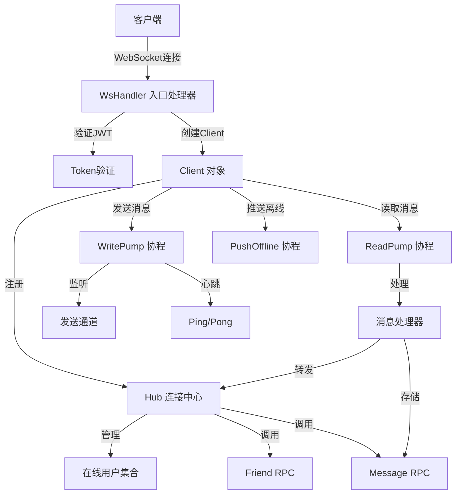
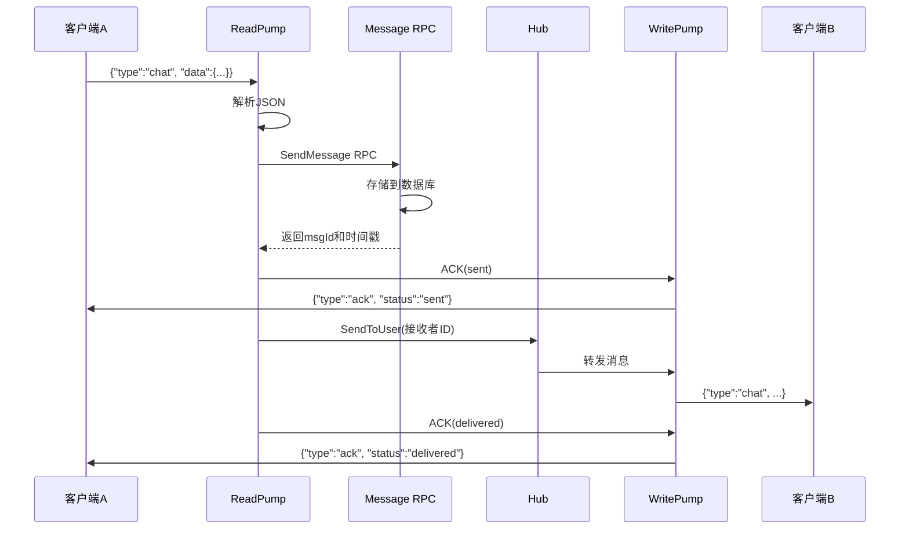
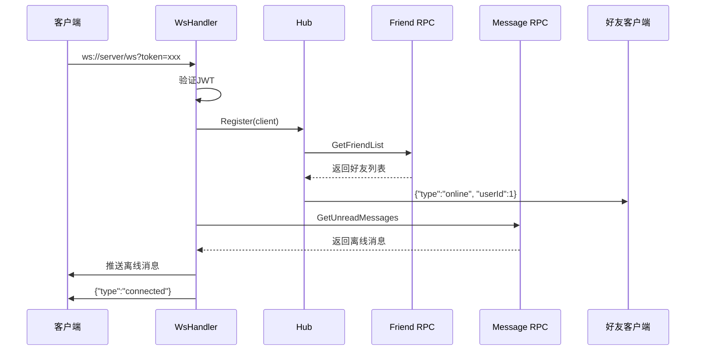

# WebSocket 实时通信模块

## 📋 目录

- [模块概述](#模块概述)
- [系统架构](#系统架构)
- [核心组件](#核心组件)
- [消息流转流程](#消息流转流程)
- [消息类型详解](#消息类型详解)
- [与其他服务的交互](#与其他服务的交互)
- [快速开始](#快速开始)
- [配置说明](#配置说明)
- [客户端接入示例](#客户端接入示例)

---

## 模块概述

WebSocket模块是SkyeIM即时通讯系统的**实时通信核心**，负责：

- ✅ 管理所有客户端的WebSocket长连接
- ✅ 实时消息的双向传输（收发）
- ✅ 用户在线状态管理和通知
- ✅ 离线消息的推送
- ✅ 心跳检测和连接保活

**服务端口**: `10300`  
**协议**: WebSocket (ws://)  
**鉴权方式**: JWT Token

---

## 系统架构



---

## 核心组件

### 1️⃣ Hub - 连接管理中心

**文件**: `internal/conn/hub.go`

Hub是整个WebSocket模块的**调度中心**，管理所有在线连接。

```go
type Hub struct {
    clients    map[int64]*Client      // userId -> Client 映射
    register   chan *Client           // 用户上线通道
    unregister chan *Client           // 用户下线通道
    broadcast  chan *BroadcastMessage // 广播通道
    private    chan *PrivateMessage   // 私聊通道
    svcCtx     *svc.ServiceContext    // RPC客户端
    mu         sync.RWMutex           // 并发保护锁
}
```

**核心方法**:
- `Run()`: 事件循环，处理注册/注销/消息转发
- `SendToUser(userId, msg)`: 发送消息给指定用户
- `IsOnline(userId)`: 检查用户是否在线
- `notifyOnlineStatus(userId, online)`: 通知好友上下线

**工作原理**:
```go
// Hub.Run() 在独立协程中永久运行
go hub.Run()

// 持续监听事件
for {
    select {
    case client := <-h.register:    // 用户上线
    case client := <-h.unregister:  // 用户下线
    case msg := <-h.broadcast:      // 广播消息
    case msg := <-h.private:        // 私聊消息
    }
}
```

---

### 2️⃣ Client - 单个WebSocket连接

**文件**: `internal/conn/client.go`

Client代表一个WebSocket连接，包含三个核心协程。

```go
type Client struct {
    Hub    *Hub                    // 指向Hub的引用
    UserId int64                   // 用户ID
    conn   *websocket.Conn         // WebSocket连接
    send   chan interface{}        // 发送通道（缓冲256）
    svcCtx *svc.ServiceContext     // RPC客户端
}
```

**三大协程**:

1. **ReadPump** - 读取协程
   ```go
   func (c *Client) ReadPump() {
       for {
           _, msgBytes, err := c.conn.ReadMessage()  // 阻塞读取
           var msg Message
           json.Unmarshal(msgBytes, &msg)
           c.handleMessage(&msg)  // 处理消息
       }
   }
   ```

2. **WritePump** - 写入协程
   ```go
   func (c *Client) WritePump() {
       ticker := time.NewTicker(pingPeriod)
       for {
           select {
           case message := <-c.send:  // 发送消息
               c.conn.WriteJSON(message)
           case <-ticker.C:  // 发送心跳
               c.conn.WriteMessage(websocket.PingMessage, nil)
           }
       }
   }
   ```

3. **pushOfflineMessages** - 推送离线消息（临时协程）
   - 连接建立后执行一次
   - 查询所有未读消息并推送
   - 完成后自动退出

---

### 3️⃣ WsHandler - WebSocket入口

**文件**: `internal/handler/wsHandler.go`

负责WebSocket连接的建立和初始化。

```go
func (h *WsHandler) ServeHTTP(w http.ResponseWriter, r *http.Request) {
    // 1. 从URL参数获取token
    token := r.URL.Query().Get("token")
    
    // 2. 验证JWT，获取userId
    userId, err := h.parseToken(token)
    
    // 3. 升级为WebSocket连接
    wsConn, err := upgrader.Upgrade(w, r, nil)
    
    // 4. 创建Client对象
    client := conn.NewClient(h.hub, wsConn, userId, h.svcCtx)
    
    // 5. 注册到Hub
    h.hub.Register(client)
    
    // 6. 推送离线消息（异步）
    go h.pushOfflineMessages(client)
    
    // 7. 启动读写协程
    go client.WritePump()
    go client.ReadPump()
}
```

---

## 消息流转流程

### 📤 消息发送流程



**详细步骤**:

1. **客户端发送**: 用户A发送聊天消息
2. **ReadPump接收**: 读取WebSocket数据并解析
3. **存储消息**: 调用Message RPC存储到数据库
4. **ACK(sent)**: 通知发送者"消息已发送"
5. **转发消息**: Hub检查接收者是否在线
6. **推送消息**: 如果在线，通过WritePump发送给用户B
7. **ACK(delivered)**: 通知发送者"消息已送达"

---

### 📥 用户上线流程



**详细步骤**:

1. **建立连接**: 客户端发起WebSocket连接
2. **JWT验证**: 验证token，获取userId
3. **注册到Hub**: 将Client加入在线用户集合
4. **通知好友**: 调用Friend RPC获取好友列表，通知在线好友
5. **推送离线消息**: 查询未读消息并推送
6. **连接成功**: 返回连接成功消息

---

## 消息类型详解

### WebSocket消息格式

所有WebSocket消息遵循统一格式：

```json
{
  "type": "消息类型",
  "data": { /* 具体数据 */ }
}
```

### 消息类型表

| Type | 方向 | 说明 | Data格式 |
|------|------|------|----------|
| **connected** | 服务端→客户端 | 连接成功通知 | `{userId, onlineCount}` |
| **ping** | 客户端→服务端 | 心跳请求 | `null` |
| **pong** | 服务端→客户端 | 心跳响应 | `null` |
| **chat** | 双向 | 聊天消息 | `ChatMessage` |
| **ack** | 服务端→客户端 | 消息确认 | `AckMessage` |
| **read** | 双向 | 已读回执 | `{peerId, msgIds[]}` |
| **online** | 服务端→客户端 | 好友上线 | `{userId, timestamp}` |
| **offline** | 服务端→客户端 | 好友下线 | `{userId, timestamp}` |
| **error** | 服务端→客户端 | 错误消息 | `{msgId, message}` |

### ChatMessage结构

```go
type ChatMessage struct {
    MsgId       string `json:"msgId"`       // 消息唯一ID（UUID）
    FromUserId  int64  `json:"fromUserId"`  // 发送者ID
    ToUserId    int64  `json:"toUserId"`    // 接收者ID
    Content     string `json:"content"`     // 消息内容
    ContentType int32  `json:"contentType"` // 1-文字 2-图片 3-文件 4-语音
    CreatedAt   int64  `json:"createdAt"`   // 创建时间戳
}
```

### AckMessage结构

```go
type AckMessage struct {
    MsgId     string `json:"msgId"`     // 消息ID
    Status    string `json:"status"`    // sent/delivered/read
    Timestamp int64  `json:"timestamp"` // 时间戳
}
```

**ACK状态说明**:
- `sent`: 消息已存储到服务器
- `delivered`: 消息已送达接收者设备
- `read`: 接收者已读消息

---

## 与其他服务的交互

### 依赖的RPC服务

```yaml
# etc/ws.yaml
MessageRpc:  # 消息服务
  Etcd:
    Hosts: [127.0.0.1:2379]
    Key: message.rpc

FriendRpc:   # 好友服务
  Etcd:
    Hosts: [127.0.0.1:2379]
    Key: friend.rpc
```

### 调用场景

| RPC服务 | 调用方法 | 调用时机 | 用途 |
|---------|----------|----------|------|
| Message RPC | `SendMessage` | 收到chat消息时 | 存储消息到数据库 |
| Message RPC | `GetUnreadMessages` | 用户上线时 | 获取离线消息 |
| Message RPC | `MarkAsRead` | 收到read消息时 | 标记消息已读 |
| Friend RPC | `GetFriendList` | 用户上/下线时 | 获取好友列表，通知在线状态 |

---

## 快速开始

### 1. 启动依赖服务

```bash
# 启动etcd
etcd

# 启动Message RPC服务
cd app/message/rpc
go run message.go -f etc/message.yaml

# 启动Friend RPC服务
cd app/friend/rpc
go run friend.go -f etc/friend.yaml
```

### 2. 启动WebSocket服务

```bash
cd app/ws
go run ws.go -f etc/ws.yaml
```

### 3. 测试连接

使用浏览器控制台测试：

```javascript
// 1. 获取token（假设已登录）
const token = "你的JWT_TOKEN";

// 2. 建立连接
const ws = new WebSocket(`ws://localhost:10300/ws?token=${token}`);

// 3. 监听事件
ws.onopen = () => console.log('✅ Connected');
ws.onmessage = (e) => console.log('📨 Received:', JSON.parse(e.data));

// 4. 发送消息
ws.send(JSON.stringify({
  type: 'chat',
  data: {
    toUserId: 2,
    content: '你好',
    contentType: 1
  }
}));
```

---

## 配置说明

### etc/ws.yaml

```yaml
Name: ws-server
Host: 0.0.0.0
Port: 10300  # WebSocket服务端口

# JWT配置（必须与Auth服务一致）
Auth:
  AccessSecret: "Skylm-im-secret-key"
  AccessExpire: 604800  # 7天

# Message RPC配置
MessageRpc:
  Etcd:
    Hosts: [127.0.0.1:2379]
    Key: message.rpc

# Friend RPC配置
FriendRpc:
  Etcd:
    Hosts: [127.0.0.1:2379]
    Key: friend.rpc

# WebSocket配置
WebSocket:
  PingInterval: 30      # 心跳间隔（秒）
  PongTimeout: 60       # Pong超时（秒）
  MaxMessageSize: 65536 # 最大消息64KB
```

**重要配置项**:
- `Auth.AccessSecret`: 必须与Auth服务的Secret一致
- `PingInterval`: 心跳间隔，建议30-60秒
- `PongTimeout`: 超时时间，必须大于PingInterval
- `MaxMessageSize`: 消息大小限制，避免大消息攻击

---

## 客户端接入示例

### Vue.js示例

```javascript
// websocket.js - WebSocket封装
class WebSocketManager {
  constructor() {
    this.ws = null;
    this.reconnectTimer = null;
  }

  connect(token) {
    this.ws = new WebSocket(`ws://localhost:10300/ws?token=${token}`);
    
    this.ws.onopen = () => {
      console.log('✅ WebSocket connected');
      this.clearReconnectTimer();
    };
    
    this.ws.onmessage = (event) => {
      const msg = JSON.parse(event.data);
      this.handleMessage(msg);
    };
    
    this.ws.onclose = () => {
      console.log('❌ WebSocket disconnected');
      this.reconnect(token);
    };
    
    this.ws.onerror = (error) => {
      console.error('WebSocket error:', error);
    };
  }
  
  handleMessage(msg) {
    switch (msg.type) {
      case 'connected':
        console.log('在线人数:', msg.data.onlineCount);
        break;
      case 'chat':
        // 收到新消息，触发事件
        window.dispatchEvent(new CustomEvent('newMessage', { detail: msg.data }));
        break;
      case 'ack':
        console.log('消息状态:', msg.data.status);
        break;
      case 'online':
        console.log('好友上线:', msg.data.userId);
        break;
      case 'offline':
        console.log('好友下线:', msg.data.userId);
        break;
    }
  }
  
  send(type, data) {
    if (this.ws && this.ws.readyState === WebSocket.OPEN) {
      this.ws.send(JSON.stringify({ type, data }));
    }
  }
  
  sendMessage(toUserId, content, contentType = 1) {
    this.send('chat', {
      toUserId,
      content,
      contentType
    });
  }
  
  markAsRead(peerId, msgIds = []) {
    this.send('read', { peerId, msgIds });
  }
  
  reconnect(token) {
    this.clearReconnectTimer();
    this.reconnectTimer = setTimeout(() => {
      console.log('🔄 Reconnecting...');
      this.connect(token);
    }, 3000);
  }
  
  clearReconnectTimer() {
    if (this.reconnectTimer) {
      clearTimeout(this.reconnectTimer);
      this.reconnectTimer = null;
    }
  }
  
  disconnect() {
    this.clearReconnectTimer();
    if (this.ws) {
      this.ws.close();
      this.ws = null;
    }
  }
}

// 使用示例
const wsManager = new WebSocketManager();

// 登录后连接
wsManager.connect(token);

// 发送消息
wsManager.sendMessage(2, '你好');

// 标记已读
wsManager.markAsRead(2);

// 退出时断开
wsManager.disconnect();
```

---

## 技术要点

### 1. 并发安全

- Hub使用`sync.RWMutex`保护clients map
- 所有map操作在Hub.Run()的单一goroutine中执行
- 使用Channel通信避免直接锁竞争

### 2. 心跳机制

```go
pingPeriod = 54秒  // 发送Ping间隔
pongWait = 60秒    // 接收Pong超时

// 设计原则：pingPeriod < pongWait
// 确保在超时前至少有一次心跳机会
```

### 3. 消息可靠性

- 先存数据库，再转发
- 三态确认（sent/delivered/read）
- 离线消息推送
- 消息去重（UUID）

### 4. 连接管理

- 重复登录：自动断开旧连接
- 优雅断线：defer清理资源
- 自动重连：客户端实现

---

## 常见问题

### Q1: Token过期后会断开连接吗？

A: 不会立即断开。Token只在连接建立时验证一次。如果需要强制下线，应该：
- 在Auth服务维护黑名单
- WebSocket定期验证Token（可选）
- 客户端收到token_expiring消息后刷新Token

### Q2: 如何处理消息顺序？

A: 
- 单一连接：ReadPump和WritePump保证顺序
- 多设备：通过CreatedAt时间戳排序
- 离线消息：按时间戳排序后推送

### Q3: 如何支持群聊？

A: 需要扩展：
- 增加GroupMessage类型
- Hub增加群组管理
- 消息转发时遍历群成员

### Q4: 如何横向扩展？

A: 使用Redis Pub/Sub：
- 多个WS服务实例
- 通过Redis广播消息
- 用户可能连接到不同实例

---

## 项目结构

```
app/ws/
├── ws.go                    # 主入口
├── README.md               # 本文档
├── etc/
│   └── ws.yaml             # 配置文件
└── internal/
    ├── config/
    │   └── config.go       # 配置结构
    ├── svc/
    │   └── serviceContext.go  # 服务上下文
    ├── conn/
    │   ├── hub.go          # Hub 连接中心
    │   └── client.go       # Client 客户端
    └── handler/
        └── wsHandler.go    # WebSocket入口
```

---

## 相关文档

- [Message RPC文档](../message/rpc/README.md)
- [Friend RPC文档](../friend/rpc/README.md)
- [API网关文档](../message/api/README.md)

---

**维护者**: SkyeIM Team  
**更新时间**: 2026-01-06
