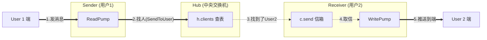

# SkyeIM WebSocket 模块核心架构设计文档

## 一、 核心设计理念

本模块采用经典的 **Hub-Client** 模式，并结合 Go 语言特性进行了并发优化。核心目标是实现**高即时性**（如私聊）与**高吞吐量**（如群聊）的平衡，同时保证系统的**故障隔离**。

### 1.1 核心并发模型 (Goroutine 拓扑)

假设有 N 个在线用户，系统运行的 Goroutine 结构如下：

*   **1 个全局 Hub 协程 (`Hub.Run`)**
    *   **角色**：系统的"中央调度器"。
    *   **职责**：串行处理连接注册、注销。对于耗时的群消息路由，它充当"任务分发者"，启动临时协程处理。
*   **2N 个用户专属协程**
    *   **ReadPump (`Client.ReadPump`)**：专门负责**收**。从网络读消息，是私聊业务逻辑的发起者。
    *   **WritePump (`Client.WritePump`)**：专门负责**发**。从 channel 取消息写回网络，并维护心跳。
*   **X 个临时路由协程**
    *   **动态创建**：每条群消息触发一个 `go routeGroupMessage`。
    *   **职责**：执行耗时的 RPC 查询和 map 遍历，避免阻塞 Hub 主循环。

---

## 二、 代码结构与职责

| 文件名 | 角色 | 核心职责 | 比喻 |
| :--- | :--- | :--- | :--- |
| **`handler/wshandler.go`** | **门卫** | 1. 处理 WebSocket 握手 (Upgrade) 2. 鉴权 (Token) 3. 初始化 Client 并启动读写协程 4. 推送离线消息 | 酒店大堂经理，负责查验身份并发房卡 |
| **`conn/hub.go`** | **调度中心** | 1. 维护全量在线用户 (`clients` map) 2. 注册/注销连接 (线程安全) 3. **路由**：决定消息该发给谁 | 交通指挥台，看着大屏幕指挥调度 |
| **`conn/client.go`** | **搬运工** | 1. 维护 TCP 连接生命周期 2. `ReadPump`: 死循环读网络 3. `WritePump`: 死循环写网络 + 心跳 | 专属快递员，只认那一条网线 |
| **`conn/client_message.go`** | **业务员** | 1. 解析消息 2. 调 RPC 存消息 3. 调 Hub 接口发起路由 | 办事员，拆开信件看内容，决定去哪办业务 |

---

## 三、 核心消息流程详解 (重点)

我们在设计中做了一个关键区分：**私聊走同步，群聊走异步**。这是基于"耗时"与"风险"的权衡。

### 3.1 私聊流程 (同步路由)

**特点**：极快，全链路几乎无 RPC（除存储外），纯内存操作。

1.  **ReadPump** 收到消息，调用 `handleChatMessage`。
2.  **存储**：调用 RPC 存入数据库 (阻塞发送者自己，合理)。
3.  **路由 (Hub.SendToUser)**：
    *   **同步调用**：直接在 `ReadPump` 协程中执行。
    *   **查表**：`h.clients[uid]` (加锁耗时纳秒级)。
    *   **投递**：`client.send <- msg` (耗时微秒级)。
4.  **发送**：目标用户的 `WritePump` 收到信号，写网线。

### 3.2 群聊流程 (异步路由)

**特点**：耗时，涉及外部 I/O (RPC/Redis)，必须隔离风险。

1.  **ReadPump** 收到消息，调用 `handleGroupChatMessage`。
2.  **存储**：调用 RPC 存入数据库。
3.  **投递 (Hub.SendToGroup)**：
    *   **极速**：仅仅把消息扔进 `h.groupMessage` 通道，立即返回。发送者不阻塞。
4.  **调度 (Hub.Run)**：
    *   Hub 主循环收到消息。
    *   **风险隔离**：立马执行 `go h.routeGroupMessage(msg)`，启动临时协程。Hub 继续处理别人上线。
5.  **路由执行 (Temporary Goroutine)**：
    *   **查成员**：调用 RPC/Redis 获取群成员 (耗时 10-200ms)。**这是必须异步的根本原因**。
    *   **并发读**：申请 `RLock` 读锁，遍历成员列表。
    *   **分发**：给每个在线成员的 channel 塞消息。

---

## 四、 并发安全机制 (锁的设计)

虽然有多个 goroutine 在跑，但我们通过**锁 (RWMutex)** 保证了安全：

1.  **Hub 主循环 (写者)**：
    *   处理 `register`/`unregister` 时，加 **Lock (写锁)**。
2.  **路由协程 (读者)**：
    *   `routeGroupMessage` 分发消息时，加 **RLock (读锁)**。

**安全证明**：由于 map 的读写都受到 mutex 保护，永远不会出现 "Hub 正在删用户，路由协程正在读用户" 的无保护冲突 (Panic)。

---

## 五、 Client 读写机制深度解析

Go 的 WebSocket 库不支持并发写，因此必须分离读写协程。

### 5.1 ReadPump (收信员)
*   **职责**：死循环监听 `conn.ReadMessage`。
*   **动作**：收到消息 -> 扔给业务层处理。

### 5.2 WritePump (发信员)
*   **职责**：死循环监听 `c.send` channel。
*   **动作**：收到信 -> `conn.WriteJSON`。
*   **心跳**：定时发 Ping。

---

## 六、 跨客户端消息流转全景图

当 **User 1 (Sender)** 发送私聊消息给 **User 2 (Receiver)** 时，数据是如何穿梭的？

### 6.1 流程图解

### 6.2 关键步骤说明

1.  **起点**：User 1 的 `ReadPump` 收到消息。
2.  **寻址**：User 1 的代码调用 `hub.SendToUser(2, msg)`。
    *   **注意**：User 1 也是先要把消息给 Hub，因为只有 Hub 知道 User 2 在哪。
3.  **投递**：Hub 在内存 map 中找到 User 2 的 Client 对象，将消息直接塞入 **User 2 的 `c.send` channel**。
    *   *误区纠正*：消息**不会**进入 User 1 的 `WritePump`（那是发回给 User 1 自己的），而是直接“瞬移”到了 User 2 的信箱里。
4.  **终点**：User 2 的 `WritePump` 发现信箱里有信，取出并推送到 User 2 的屏幕上。

### 6.3 总结
**Hub 是连接两个独立 Client 的唯一桥梁。** 没有 Hub，Client 之间就是孤岛，无法互相通信。
