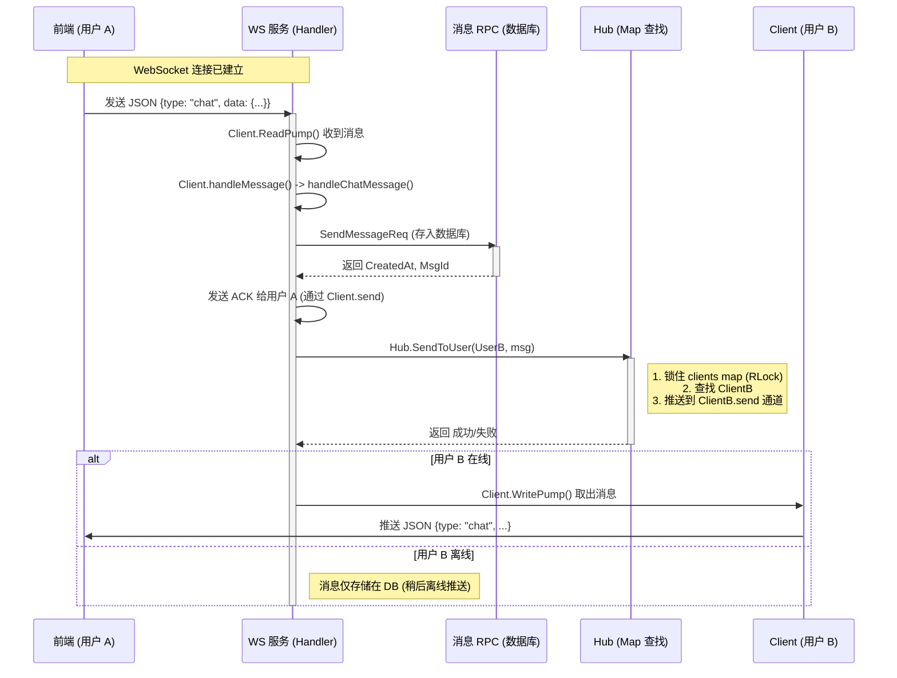
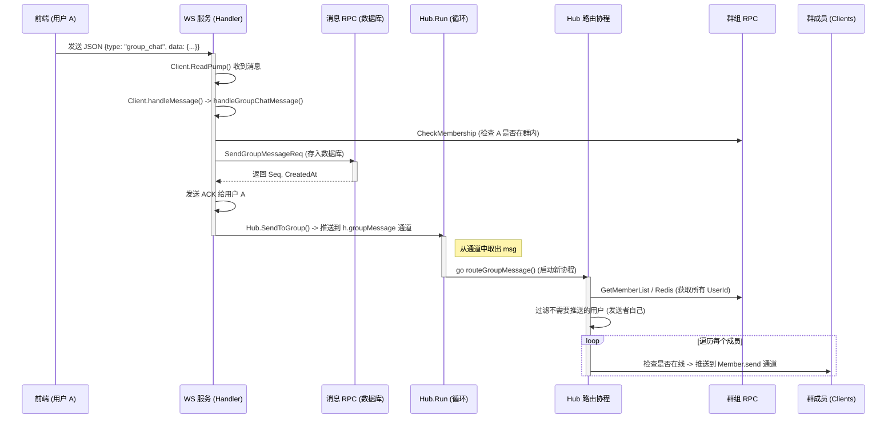

# 消息发送流程分析 (Message Flow Analysis)

本文档详细说明了 SkyeIM 中消息发送（私聊和群聊）的完整流程，并回答了关于 `Hub.Run` 职责的具体问题。

## 1. Hub.Run 角色分析

**问：`Hub.Run` 一直在自己的 goroutine 里面监听消息，那这种只监听了群聊消息？那私聊消息的发放呢？**

**答：是的。**
-   `Hub.Run` 循环（在 `hub.go` 中）严格只监听三个通道：`register`（注册）、`unregister`（注销）和 `groupMessage`（群消息）。
-   **私聊消息** 明确 **绕过（BYPASS）** 了 `Hub.Run` 循环。
-   **原因**：私聊消息的分发是非常简单的 O(1) Map 查找（`clients[userId]`）。它被设计为 **同步处理**，以确保低延迟，并避免所有的 1 对 1 流量都去挤占同一个 `Hub.Run` 循环的资源。
-   **群聊消息** 使用 `Hub.Run`，因为它们需要一个 **异步流程** 来处理：
    1.  查找群成员（可能涉及 RPC/Redis IO 操作）。
    2.  扇出（Fan-out）消息给多个用户。
    3.  这样可以防止 WebSocket 处理程序在等待群成员查找时被阻塞。

---

## 2. 私聊消息流程 (直发模式)

私聊消息走的是 **同步** 路径。

### 涉及的关键方法：
1.  **入口**: `app/ws/internal/conn/client.go` -> `ReadPump`
2.  **逻辑**: `app/ws/internal/conn/client_message.go` -> `handleChatMessage`
3.  **存储**: `app/message/rpc/internal/logic/sendmessagelogic.go` -> `SendMessage`
4.  **路由**: `app/ws/internal/conn/hub.go` -> `SendToUser` (直接 Map 访问，**不走 Run**)

---

## 3. 群聊消息流程 (异步广播)

群聊消息走的是 **异步** 路径，经过 `Hub.Run`。

### 涉及的关键方法：
1.  **入口**: `app/ws/internal/conn/client.go` -> `ReadPump`
2.  **逻辑**: `app/ws/internal/conn/client_message.go` -> `handleGroupChatMessage`
3.  **存储**: `app/message/rpc/internal/logic/sendgroupmessagelogic.go` -> `SendGroupMessage`
4.  **路由入口**: `app/ws/internal/conn/hub.go` -> `SendToGroup` (推送到 Channel)
5.  **核心处理**: `app/ws/internal/conn/hub.go` -> `Run` (从 Channel 取出)
6.  **分发**: `app/ws/internal/conn/hub.go` -> `routeGroupMessage` (遍历 & 发送)
