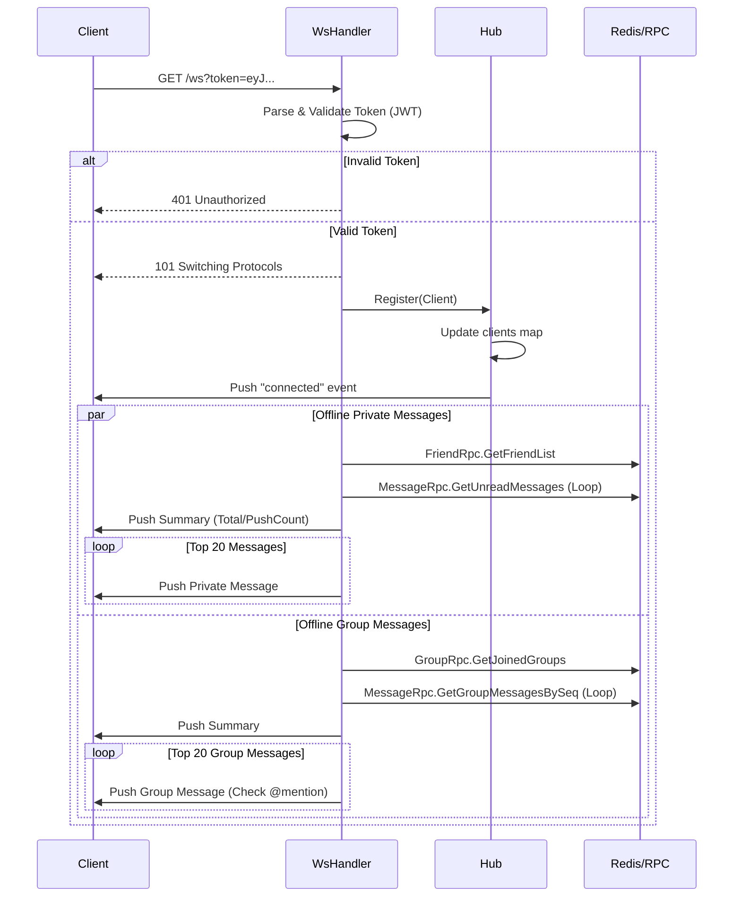

# SkyeIM WebSocket 服务架构深度解析

> **核心设计理念**: 本服务采用 **Hub-Client 模式**，结合 Go 语言并发特性，实现了**私聊同步路由**（低延迟）与**群聊异步路由**（高吞吐、故障隔离）的混合架构。

---

## 一、 服务概述

WebSocket 服务是 SkyeIM 的**实时通信核心**，负责维护客户端的长连接、实时推送消息、在线状态管理等核心功能。它作为无状态的接入层，通过 RPC 与业务层交互，通过 Redis 共享状态。

### 1.1 技术选型

| 组件 | 技术 | 用途 |
| --- | --- | --- |
| **接入层** | [gorilla/websocket](https://github.com/gorilla/websocket) | Go 社区标准 WebSocket 库 |
| **框架** | go-zero | 微服务治理、RPC 调用 |
| **状态/缓存** | Redis | 维护在线用户集合、群成员缓存 |
| **通信** | gRPC | 调用 Message/Group/Friend 服务 |

### 1.2 目录结构

```text
app/ws/
├── etc/
│   └── ws.yaml                   # 配置文件
├── internal/
│   ├── config/                   # 配置定义
│   ├── conn/                     # 连接管理核心
│   │   ├── client.go             # [搬运工] 单个连接读写、心跳
│   │   ├── client_message.go     # [业务员] 消息业务逻辑 (Chat, Group, Ack)
│   │   ├── hub.go                # [调度中心] 连接池管理、消息路由核心
│   │   └── types.go              # 消息类型定义
│   ├── handler/                  # HTTP 处理器
│   │   ├── wshandler.go          # [门卫] WebSocket 升级、鉴权、离线消息推送
│   │   └── pushhandler.go        # [内部接口] 处理来自 RPC 的推送请求
│   └── svc/                      # 服务上下文
│       └── service_context.go    # RPC/Redis 客户端
└── ws.go                         # 主入口
```

---

## 二、 核心架构设计

### 2.1 核心组件与职责

系统架构类似于机场调度系统，各组件职责分明：

| 组件 | 对应文件 | 角色 | 核心职责 | 比喻 |
| :--- | :--- | :--- | :--- | :--- |
| **WsHandler** | `handler/wshandler.go` | **安检/门卫** | 1. 处理 WebSocket 握手 (Upgrade)<br>2. 校验 JWT Token<br>3. 初始化 Client 并注册到 Hub<br>4. **主动推送离线消息** (私聊+群聊) | 酒店前台 |
| **PushHandler** | `handler/pushhandler.go` | **内部信使** | 1. 接收内部 RPC 服务 (Friend/Group/Message) 的推送请求<br>2. 校验内部调用凭证 `X-Skyeim-Push-Secret` | 内部对讲机 |
| **Hub** | `conn/hub.go` | **调度塔台** | 1. 维护全量在线连接映射 (`map[int64]*Client`)<br>2. **路由决策**：决定消息发给谁<br>3. **广播**：管理群聊消息分发 (异步) | 交通指挥台 |
| **Client** | `conn/client.go`<br>`conn/client_message.go` | **专属摆渡车** | 1. 维护 TCP 连接生命周期<br>2. **ReadPump/WritePump**: 负责收发网络包<br>3. **业务逻辑**: 处理 Chat/Ack/Read 等具体消息 | 专属快递员 |

### 2.2 Hub-Client 核心模型

```mermaid
classDiagram
    class Hub {
        -clients: map[int64]*Client
        -register: chan *Client
        -unregister: chan *Client
        -groupMessage: chan *GroupMessage
        +Run()
        +Register(client)
        +SendToUser(uid, msg)
        +SendToGroup(gid, msg)
        +NotifyGroupEvent(gid, event, data)
    }
    class Client {
        -Hub: *Hub
        -conn: *websocket.Conn
        -send: chan interface{}
        +ReadPump()
        +WritePump()
        +Close()
    }
    Hub "1" *-- "N" Client : manages
```

**Hub 核心数据结构**:
```go
type Hub struct {
    clients      map[int64]*Client      // 在线用户映射
    register     chan *Client           // 注册通道
    unregister   chan *Client           // 注销通道
    groupMessage chan *GroupMessage     // 群消息异步通道（缓冲256）
    mu           sync.RWMutex           // 读写锁保护 clients
}
```

---

## 三、 核心通信流程 (Sync vs Async)

为了平衡**即时性**与**吞吐量**，我们区分了两种路由策略：

### 3.1 私聊流程 (同步路由 - 极速)

**特点**：纯内存操作，无额外 RPC，延迟微秒级。

```mermaid
graph LR
    A[RPC/API] -->|HTTP Push| B(PushHandler)
    B -->|调用| C(Hub.SendToUser)
    C -->|RLock 查表| D{目标在线?}
    D -->|Yes| E[直接写入 Client.send Channel]
    D -->|No| F[记录日志/忽略 (消息已存DB)]
    E -->|唤醒| G[Client WritePump]
    G -->|WebSocket| H[接收者客户端]
```

**代码实现 (`hub.go`)**:
```go
func (h *Hub) SendToUser(userId int64, msg *Message) bool {
    h.mu.RLock() // 加读锁，极大提升并发读性能
    client, ok := h.clients[userId]
    h.mu.RUnlock()

    if ok {
        // 非阻塞写入，防止某个慢连接阻塞发送者
        select {
        case client.send <- msg:
            return true
        default:
            // 缓冲区满，视为异常断开或网络拥塞
            logx.Errorf("Send buffer full for user %d", userId)
        }
    }
    return false
}
```

### 3.2 群聊流程 (异步路由 - 隔离)

**特点**：涉及群成员查找 (Redis/RPC)，耗时较长 (ms级)，**必须异步**以防阻塞 Hub 主循环。

1.  **投递**：`hub.SendToGroup()` 仅将消息放入 `h.groupMessage` 缓冲通道，**立即返回**。
2.  **调度**：Hub 主循环取出消息，启动临时协程 `go h.routeGroupMessage()`。
3.  **分发 (临时协程)**：
    *   **查成员**：优先查 Redis 缓存 (`im:group:members:{gid}`)，未命中则同步调用 `Group RPC`。
    *   **遍历**：获取所有成员 ID。
    *   **路由**：循环调用 `SendToUser` (复用私聊逻辑) 分发给在线成员。

**为何群聊要异步？**
如果群聊也同步处理，在获取群成员列表时（可能涉及 DB IO），Hub 的锁会被持有或主循环被阻塞，导致此时全服任何人都无法登录、注销，系统吞吐量将急剧下降。

---

## 四、 详细业务流程图解

### 4.1 连接建立与离线消息推送



### 4.2 消息发送全链路 (以私聊为例)

**注意**: WS 服务仅负责**推送**。消息的**发送/持久化**需客户端调用 HTTP API (`Message 服务`)。

```text
客户端 A (HTTP POST /message/send)
    ↓
Message 服务 (API/RPC)
    ├─ 1. 鉴权与风控
    ├─ 2. 存储 MySQL (im_message)
    ├─ 3. 写入 Redis 离线队列 (可选)
    └─ 4. 调用 WS 服务 (HTTP POST /ws/push) <--- 触发推送
            ↓
    [ws/internal/handler/pushhandler.go]
            ↓
    [ws/internal/conn/hub.go] SendToUser
            ↓
    [ws/internal/conn/client.go] WritePump
            ↓
    客户端 B (WebSocket Receive)
```

---

## 五、 关键技术细节

### 5.1 Redis 状态管理设计

| Key | 类型 | 示例 | 作用 |
| :--- | :--- | :--- | :--- |
| `im:group:members:{gid}` | Set | `{1001, 1002, 1003}` | 群成员列表缓存 (TTL 7天)。<br>未命中时调用 GroupRPC 加载并写入。 |
| (RPC内部使用) | - | - | WS 服务本身不直接读写复杂的业务 Redis Key，而是依赖 Message/Group RPC 封装。 |

### 5.2 心跳保活机制 (Heartbeat)

*   **Server -> Client (Ping)**:
    *   `WritePump` 协程包含一个 Ticker (`const pingPeriod = 54s`)。
    *   每 54 秒向客户端发送标准 WebSocket Ping 帧。
*   **Client -> Server (Pong)**:
    *   `ReadPump` 设置了读取超时 `SetReadDeadline(now + 60s)`。
    *   每当收到 Pong 帧，重置超时时间。
    *   **死锁判定**: 如果 60 秒内既没收到消息也没收到 Pong，判定为**网络僵死**，断开连接。

### 5.3 离线消息策略 (优化版)

为了防止海量离线消息阻塞连接或导致“消息风暴”：

1.  **限制条数**: 
    *   无论是私聊还是群聊，连接建立时**最多只推送最近 20 条**未读消息。
2.  **推送摘要**:
    *   在推送具体消息前，先推送一条 `offline_messages` 类型的摘要消息，包含 `totalCount` (总未读数) 和 `pushCount` (本次推送数)。
3.  **客户端处理**:
    *   客户端收到摘要后，知道还有更多历史消息，可根据需要（如用户上滑）调用 HTTP 接口分页拉取剩余历史记录。
4.  **群聊特权**:
    *   群聊离线消息计算时，会过滤掉用户加群之前的历史消息 (`msg.CreatedAt >= user.JoinedAt`)。
    *   会特别标记 `@我` 的消息。

---

## 六、 常见问题 (FAQ)

### Q1: 为什么同一个连接需要 ReadPump 和 WritePump 两个协程？
A: Go 的 `websocket.Conn` 不支持**并发写**（多个协程同时调用 `WriteJSON` 会导致 panic），但支持**并发读写**（一个读，一个写）。
因此我们设计了：
*   **ReadPump**: 独占读取权限，死循环阻塞读取。
*   **WritePump**: 独占写入权限。其他所有想发给该客户端的消息（RPC推送、心跳、Hub广播）都必须先发给 `client.send` channel，由 WritePump 统一串行化写入。

### Q2: 既然有了 HTTP，为什么还需要 WebSocket？
A: 
1.  **实时性**: 下行推送（服务端 -> 客户端）HTTP 无法做到毫秒级，轮询太耗资源。
2.  **状态感知**: 上下线状态、正在输入等状态需要长连接实时同步。
3.  **全双工**: 发送消息时无需重复握手（TLS握手耗时）。

### Q3: 如何支持多实例部署 (Cluster)？
A: 当前架构支持水平扩展，方案如下：
1.  **用户分片**: 客户端连接请求经过 Nginx 负载均衡到不同 WS 节点。
2.  **Redis Pub/Sub** (规划中): 
    *   当 Server A 收到需要发给 User B 的消息，但 User B 连在 Server B 上。
    *   Server A 发现本地 map 没在这个人，则 Publish 消息到 Redis `ws:broadcast` 频道。
    *   所有 WS 节点订阅该频道，Server B 收到后发现 User B 在自己这，执行推送。

---

**文档维护**: Skylm
**最后更新**: 2026-01-20
