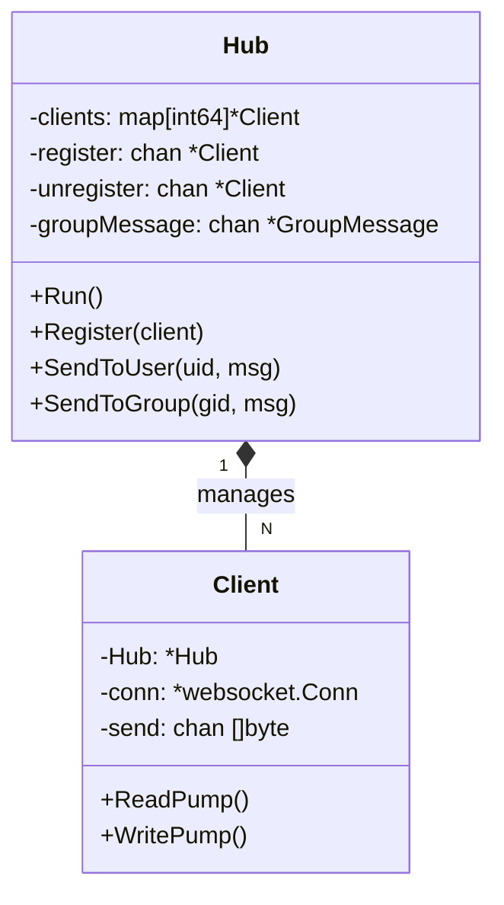

# SkyeIM WebSocket 服务架构深度解析

> **核心设计理念**: 本服务采用 **Hub-Client 模式**，结合 Go 语言并发特性，实现了**私聊同步路由**（低延迟）与**群聊异步路由**（高吞吐、故障隔离）的混合架构。

---

## 一、 服务概述

WebSocket 服务是 SkyeIM 的**实时通信核心**，负责维护客户端的长连接、实时推送消息、在线状态管理等核心功能。它作为无状态的接入层，通过 RPC 与业务层交互，通过 Redis 共享状态。

### 1.1 技术选型

| 组件 | 技术 | 用途 |
| --- | --- | --- |
| **接入层** | [gorilla/websocket](https://github.com/gorilla/websocket) | Go 社区标准 WebSocket 库 |
| **框架** | go-zero | 微服务治理、RPC 调用 |
| **状态/缓存** | Redis | 维护在线用户集合、离线消息队列 |
| **通信** | gRPC | 调用 Message/Group/Friend 服务 |

### 1.2 目录结构

```text
app/ws/
├── etc/
│   └── ws.yaml                   # 配置文件
├── internal/
│   ├── config/                   # 配置定义
│   ├── conn/                     # 连接管理核心
│   │   ├── client.go             # [搬运工] 单个连接读写、心跳
│   │   ├── hub.go                # [调度中心] 连接池管理、消息路由核心
│   │   └── types.go              # 消息类型定义
│   ├── handler/                  # HTTP 处理器
│   │   ├── ws_handler.go         # [门卫] WebSocket 升级、鉴权
│   │   └── push_event_handler.go # 内部事件推送接口
│   └── svc/                      # 服务上下文
│       └── service_context.go    # RPC/Redis 客户端
└── ws.go                          # 主入口
```

---

## 二、 核心架构设计

### 2.1 核心组件与职责

系统架构类似于机场调度系统，各组件职责分明：

| 组件 | 对应文件 | 角色 | 核心职责 | 比喻 |
| :--- | :--- | :--- | :--- | :--- |
| **Handler** | `ws_handler.go` | **安检/门卫** | 1. 处理 WebSocket 握手 (Upgrade)<br>2. 校验 JWT Token<br>3. 初始化 Client 并注册到 Hub | 酒店前台 |
| **Hub** | `hub.go` | **调度塔台** | 1. 维护全量在线连接映射 (`map[int64]*Client`)<br>2. **路由决策**：决定消息发给谁<br>3. **广播**：管理群聊消息分发 | 交通指挥台 |
| **Client** | `client.go` | **专属摆渡车** | 1. 维护 TCP 连接生命周期<br>2. **ReadPump**: 专职从网线收信<br>3. **WritePump**: 专职向网线发信 + 维护心跳 | 专属快递员 |

### 2.2 Hub-Client 核心模型



**Hub 核心数据结构**:
```go
type Hub struct {
    clients      map[int64]*Client      // 在线用户映射
    register     chan *Client           // 注册通道
    unregister   chan *Client           // 注销通道
    groupMessage chan *GroupMessage     // 群消息异步通道（缓冲256）
    mu           sync.RWMutex           // 读写锁保护 clients
}
```

---

## 三、 核心通信流程 (Sync vs Async)

为了平衡**即时性**与**吞吐量**，我们区分了两种路由策略：

### 3.1 私聊流程 (同步路由 - 极速)

**特点**：纯内存操作，无额外 RPC，延迟微秒级。

```mermaid
graph LR
    A[发送者 ReadPump] -->|1. 收到消息| B(Hub.SendToUser)
    B -->|2. RLock 查表| C{目标在线?}
    C -->|Yes| D[直接写入目标 Channel]
    C -->|No| E[存离线队列(Redis)]
    D -->|3. 唤醒| F[目标 WritePump]
    F -->|4. 推送| G[接收者客户端]
```

**代码实现 (`hub.go`)**:
```go
func (h *Hub) SendToUser(userId int64, msg *Message) bool {
    h.mu.RLock() // 加读锁，极大提升并发读性能
    client, ok := h.clients[userId]
    h.mu.RUnlock()

    if ok {
        // 非阻塞写入，防止某个慢连接阻塞发送者
        select {
        case client.send <- msg:
            return true
        default:
            close(client.send) // 缓冲区满，视为异常断开
            delete(h.clients, userId)
        }
    }
    return false
}
```

### 3.2 群聊流程 (异步路由 - 隔离)

**特点**：涉及群成员查找 (Redis/RPC)，耗时较长 (ms级)，**必须异步**以防阻塞 Hub 主循环。

1.  **投递**：`hub.SendToGroup()` 仅将消息放入 `h.groupMessage` 缓冲通道，**立即返回**。
2.  **调度**：Hub 主循环取出消息，启动临时协程 `go h.routeGroupMessage()`。
3.  **分发 (临时协程)**：
    *   **查成员**：优先查 Redis 缓存 (`im:group:members:{gid}`)，未命中则同步 RPC。
    *   **遍历**：获取所有成员 ID。
    *   **路由**：循环调用 `SendToUser` (复用私聊逻辑) 分发给在线成员。

**为何群聊要异步？**
如果群聊也同步处理，在获取群成员列表时（可能涉及 DB IO），Hub 的锁会被持有或主循环被阻塞，导致此时全服任何人都无法登录、注销，系统吞吐量将急剧下降。

---

## 四、 详细业务流程图解

### 4.1 连接建立与握手

```text
客户端请求 GET /ws?token=eyJ...
    ↓
[ws_handler.go] 校验 JWT Token
    ├─ 无效 → 401 Unauthorized
    └─ 有效 ↓
HTTP 升级为 WebSocket (101 Switching Protocols)
    ↓
创建 Client 实例
    ↓
[hub.go] 注册 (h.register <- client)
    ↓
1. 踢掉旧连接 (互斥登录)
2. 写入 clients 表
3. 广播"好友上线"通知
4. 启动 ReadPump / WritePump
    ↓
[push_event.go] 推送离线消息
    ↓
从 Redis `offline:private:{uid}` 拉取前 20 条
```

### 4.2 消息发送全链路

**客户端发送 Payload**:
```json
{
    "type": "chat",
    "data": {
        "toUserId": 1002,
        "content": "Hello",
        "contentType": 1
    }
}
```

**服务端处理链路**:
1.  **ReadPump**: 反序列化 JSON。
2.  **Handler**: 识别 `type=chat`，调用业务逻辑。
3.  **RPC**: 调用 `Message RPC`：
    *   验证好友关系。
    *   生成全局唯一 `msgId`。
    *   写入 MySQL `im_message` 表。
    *   返回完整消息对象（含 `createAt`）。
4.  **Ack**: 立即通过 WritePump 回复发送者 `ack` 消息。
5.  **Push**: 调用 `Hub.SendToUser` 推送给接收者。

---

## 五、 关键技术细节

### 5.1 Redis 状态管理设计

| Key | 类型 | 示例 | 作用 |
| :--- | :--- | :--- | :--- |
| `online:users` | Set | `{1001, 1002}` | 全服在线用户集合 (用于统计和广播) |
| `group:online:{gid}` | Set | `{1001, 1002}` | 某群的在线成员集合 |
| `im:group:members:{gid}` | Set | `{1001, 1002, 1003}` | 群成员列表缓存 (TTL 7天, 群成员变动时删除) |
| `offline:private:{uid}` | List | `[{msg...}, ...]` | 私聊离线消息队列 (LPUSH/LPOP) |

### 5.2 心跳保活机制 (Heartbeat)

*   **Server -> Client (Ping)**:
    *   `WritePump` 协程包含一个 Ticker (`const pingPeriod = 54s`)。
    *   每 54 秒向客户端发送标准 WebSocket Ping 帧。
*   **Client -> Server (Pong)**:
    *   `ReadPump` 设置了读取超时 `SetReadDeadline(now + 60s)`。
    *   每当收到 Pong 帧，重置超时时间。
    *   **死锁判定**: 如果 60 秒内既没收到消息也没收到 Pong，判定为**网络僵死**，断开连接。

### 5.3 离线消息策略

*   **私聊 (Websocket 推送)**: 
    *   用户不在线时，消息存入 Redis List。
    *   用户上线建立连接时，主动推送前 20 条。
    *   客户端收到后，如有更多需求，通过 HTTP 拉取历史。
*   **群聊 (HTTP 拉取)**: 
    *   **不通过 WebSocket 推送离线群消息**（避免群消息风暴炸掉刚连上的客户端）。
    *   客户端本地维护每个群的 `read_seq`。
    *   连接建立后，客户端主动调用 `GET /message/group/sync`，传入本地 seq，服务端返回 ` > seq` 的消息增量。

---

## 六、 常见问题 (FAQ)

### Q1: 为什么同一个连接需要 ReadPump 和 WritePump 两个协程？
A: Go 的 `websocket.Conn` 不支持**并发写**（多个协程同时调用 `WriteJSON` 会导致 panic），但支持**并发读写**（一个读，一个写）。
因此我们设计了：
*   **ReadPump**: 独占读取权限，死循环阻塞读取。
*   **WritePump**: 独占写入权限。其他所有想发给该客户端的消息（RPC推送、心跳、Hub广播）都必须先发给 `client.send` channel，由 WritePump 统一串行化写入。

### Q2: 既然有了 HTTP，为什么还需要 WebSocket？
A: 
1.  **实时性**: 下行推送（服务端 -> 客户端）HTTP 无法做到毫秒级，轮询太耗资源。
2.  **状态感知**: 上下线状态、正在输入等状态需要长连接实时同步。
3.  **全双工**: 发送消息时无需重复握手（TLS握手耗时）。

### Q3: 如何支持多实例部署 (Cluster)？
A: 当前架构支持水平扩展，方案如下：
1.  **用户分片**: 客户端连接请求经过 Nginx 负载均衡到不同 WS 节点。
2.  **Redis Pub/Sub**: 
    *   当 Server A 收到需要发给 User B 的消息，但 User B 连在 Server B 上。
    *   Server A 发现本地 map 没在这个人，则 Publish 消息到 Redis `ws:broadcast` 频道。
    *   所有 WS 节点订阅该频道，Server B 收到后发现 User B 在自己这，执行推送。
*(注: 当前代码已预留 Pub/Sub 接口，待后续版本实装)*

---

**文档维护**: Skylm
**最后更新**: 2026-01-18

